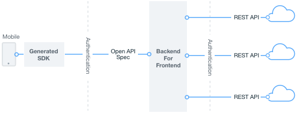

---

copyright:
  years: 2017
lastupdated: "2017-03-17"

---
{:new_window: target="_blank"}
{:shortdesc: .shortdesc}
{:screen: .screen}
{:codeblock: .codeblock}
{:pre: .pre}

# コンピュート
{: #compute}

Web およびモバイル用のクラウド・ネイティブ・デジタル・チャネル・アプリケーションを作成している時のベスト・プラクティスは、デジタル・チャネル専用であるか、または Web とモバイル両方のクライアント・アプリに対して同じデータおよびロジックの統合サポートを提供する Backend for Frontend (BFF) を用意することです。このアーキテクチャーについて詳しくは、[Microservices for web and mobile ](https://www.ibm.com/devops/method/content/architecture/omnichannelArchitecture) を参照してください。

以下の図は、BFF アーキテクチャーの概要を示しています。



図 1: BFF アーキテクチャー

BFF の概念は、共通のビジネス・ロジックと統合ロジックをマイクロサービスまたは高価値の {{site.data.keyword.Bluemix}} クラウド・サービスから取り除くことです。

このアーキテクチャーでは、DevOps Services で継続的デリバリー・パイプラインを使用することにより、モバイル・アプリケーションおよび Web アプリケーションに更新をデプロイおよびリリースし、BFF の新しいバージョンをデプロイすることができます。

iOS 用の BFF があり、それとは別個の Android 用の BFF がある場合、これらのアプリの機能を配信しているエンジニアリング・チームは、集中管理された API リリース・スケジュールによるフィーチャーのリリースに制約されません。別のチームのリリース・スケジュールに縛られることなく、機能およびフィーチャーを頻繁にリリースできるようにチームを解放することが、マイクロサービス・アーキテクチャーとデジタル・チャネル・アーキテクチャーの共通の目標です。

<!--
## Backend for Frontends (BFF)
{: #bff}

Backend for Frontend patterns, commonly known as BFFs, really help you to focus on exposing business data and services in a form that matches the user interaction requirements. To optimize a user journey to your cloud solution, it may require a different user journey for the mobile application and a richer, more detailed journey for the Web application. With the introduction of voice-controlled devices like the [{{site.data.keyword.conversationfull}} ](https://www.ibm.com/watson/developercloud/conversation.html) service, the interaction with a user could be controlled by voice. This digital channel will require a very different BFF for managing these voice intent-based interactions.

With {{site.data.keyword.Bluemix_notm}}, you can build a BFF by using polyglot programming approach to define the BFF. IBM recommends using Node, Swift, or Java and running them in a cloud native pattern with either Cloud Foundry, Container services, or serverless.

The BFF will manage the integration with services for data persistence, caching, and integration with high-value services like {{site.data.keyword.ibmwatson}}, {{site.data.keyword.iot_short_notm}}, {{site.data.keyword.weather_short}}, and data analytics like {{site.data.keyword.sparks}}.

The BFF will expose an API most commonly using a REST pattern, but you can design your BFF to work from a messaging architecture using {{site.data.keyword.messagehub}}.
-->


## モバイル・クライアントと Backend for Frontend との統合
{: #integration}

モバイル・クライアントと BFF の間の容易な統合を可能にするために、{{site.data.keyword.Bluemix_notm}} は、iOS 用と Android 用のモバイル・クライアント SDK の生成を、それぞれ Swift 言語と Java 言語でサポートしています。このフィーチャーを有効にするには、Open API 仕様 (Swagger) 文書を使用して BFF 統合を公開する必要があります。この資料は、JSON または YAML の形式の場合があります。

クライアント SDK 生成プログラムは、Open API 定義ファイルを使用して、ネイティブ・モバイル・アプリケーションに容易に取り込むことができる、クライアント用に最適化された Developer SDK を定義します。これにより、モバイル・アプリケーションへの BFF の統合が加速されます。


## API の定義
{: #definition}

BFF は、稼働中のサーバー・エンドポイントで実行されている Open API 仕様に準拠した API 定義ファイルを公開する必要があります。{{site.data.keyword.Bluemix_notm}} Developer Experience と {{site.data.keyword.Bluemix_notm}} SDK CLI (コマンド・ライン・インターフェース) がこのエンドポイントを検出できるようにするには、`OPENAPI_SPEC` と呼ばれる環境変数を Cloud Foundry アプリケーションに追加する必要があります。この環境変数は、相対パスを使用して仕様を参照している必要があります。

`OPENAPI_SPEC` 環境変数を {{site.data.keyword.Bluemix_notm}} に追加するには、以下のステップを実行してください。

1. [{{site.data.keyword.Bluemix_notm}} ](http://bluemix.net) にログインします。
2. Cloud Foundry アプリを選択します。
3. **「ランタイム」**を選択します。
4. **「環境変数」**を選択します。
5. **「ユーザー定義」**セクションで**「追加」**をクリックします。
6. **「名前」**に `OPENAPI_SPEC` を指定し、Open API 定義ファイルの相対 URL パスを指定します。
7. **「保存」**をクリックします。

<!--
To add the `OPENAPI_SPEC` environment variable locally and push your changes to {{site.data.keyword.Bluemix_notm}} with the [Cloud Foundry CLI ](https://github.com/cloudfoundry/cli#getting-started), follow these steps:

1. Open Terminal and navigate to your project directory.
2. Add the following code to the `manifest.yml` file.

   ```
   env:
       "OPENAPI_SPEC": "<relative URL path to your Open API definition file>"
   ```
   {: codeblock}
3. Save your changes to the `manifest.yml` file.
4. Run `cf push` to deploy the changes to {{site.data.keyword.Bluemix_notm}}.
-->

以下に例を示します。

```
OPENAPI_SPEC='/explorer/swagger.json'
```
{: codeblock}

{{site.data.keyword.apiconnect_long}} および Loopback アプリケーションは、このアプローチを使用すると特によく機能します。Loopback と {{site.data.keyword.apiconnect_short}} を使用してパーシスタント・モデルを定義し、Open API 定義ファイルを使用して CRUD (Create、Read、Update、および Delete) の各操作を公開できます。

また、ビジネス・ロジック操作も定義することができます。


### Open API 仕様のサポートされる要素
{: #supported-elements notoc}

Open API 仕様において、ファイル構造のみが完全にサポートされていません。この仕様は、定義の部分がさまざまなファイルに分割されること、および JSON の `$ref` フィールドを使用して参照されることを許可しています。定義全体を、1 つのファイル内に含める必要があります。


## Bluegen を使用した Backend for Frontend の例
{: #bff-bluegen}

{{site.data.keyword.Bluemix_notm}} は、{{site.data.keyword.apiconnect_short}} と Strongloop を使用して参照 BFF を作成しました。この参照 BFF は、{{site.data.keyword.objectstorageshort}} でイメージを参照するために、製品モデルを {{site.data.keyword.cloudant}} およびイメージ API にマップします。

この BFF パターンを使用して、完全に機能する BFF の {{site.data.keyword.Bluemix_notm}} へのプロビジョニングを素早く開始し、それを使用して、BFF をモバイル・プロジェクトに統合し、iOS 用と Android 用のネイティブ SDK をそれぞれ Swift と Java で生成することがどれほど簡単かを理解するのに役立てることができます。

プロジェクトを作成してインストールするための、[README ](https://github.com/ibm-bluemix-mobile-services/backend-for-frontend-node) の説明に従ってください。


## Developer Experience プロジェクトでの Backend for Frontend の使用
{: #bff-devex}

{{site.data.keyword.Bluemix_notm}} Mobile Developer Experience は、多くのクラウド・サービスが関連付けられたモバイル・プロジェクトの定義をシンプルにするように設計されています。[{{site.data.keyword.mobilepushshort}} ](/docs/services/mobilepush/index.html)、[Analytics ](/docs/services/mobileanalytics/index.html)、および Data サービスまたは Storage サービスを容易に追加することができます。

{{site.data.keyword.Bluemix_notm}} {{site.data.keyword.dev_console}} では、**「コンピュート」**ページで BFF をモバイル・プロジェクトに統合する機能が導入されました。既存のコンピュート・サービス・インスタンスをモバイル・プロジェクトに追加することができます。それらが追加された後は、選択した言語用のネイティブ SDK を生成するか、フル・プロジェクトを生成できます。SDK は、**「コード」**ページでプロジェクトのソース・パッケージに統合されます。これは、既に適切に定義されている BFF と統合する際に特に役立ちます。

プロジェクトをダウンロードしたら、それを Xcode または Android Studio で開き、クライアント SDK を使用してプロジェクトをコンパイルすることができます。


## CLI の使用
{: #cli}

BFF を開発している時に、API 仕様が変更される場合があります。これらの変更をサポートするために、以下の 2 つのオプションがあります。

* プロジェクト全体を再生成して新しい GitHub ブランチを作成し、変更を開発ブランチにマージする。
* コマンド・ライン (CLI) ツールを使用して SDK を直接再生成し、モバイル・プロジェクトの SDK 部分だけを更新する。

CLI を使用するには、CLI を[インストール](sdk_cli.html#installation)する必要があります。

以下のコマンドを使用すると、実行できるアクションがリストされます。

```
bluemix sdk
```
{: codeblock}

以下のコマンドを使用して、現行の {{site.data.keyword.Bluemix_notm}} スペース内で実行中の Cloud Foundry インスタンスをリストします。

```
bluemix sdk list
```
{: codeblock}

各アプリがリストされ、`OPENAPI_SPEC` 環境変数が設定されているかどうか、API が検証されます。`VALID` 列に、緑色のチェック・マークまたは赤色の `X` が表示されます。アプリケーションの `VALID` 列内のチェック・マークは、有効な Open API 定義があることを意味しています。アプリケーションの `VALID` 列内に `X` がある場合は、次の 2 つのうちのいずれかを意味しています。

* アプリケーションに対して `OPENAPI_SPEC` 環境変数が定義されていない
* Open API 仕様に関して API 定義が無効である

以下のコマンドを使用して、API の完全形式の URL を表示します。API 仕様の完全形式の経路と URI がリストされます。そのロー仕様をブラウザーで表示したり、CLI に直接取り込んだり、BFF の `OPENAPI_SPEC` 環境変数が正しく設定されているかどうかを確認したりできます。

```
bluemix sdk list --url
```
{: codeblock}

以下のコマンドを使用して、`<AppName>` の Open API 定義ファイルを検証し、それを使用して SDK を生成できるかどうかを判別します。このコマンドは、現行スペース内の `<AppName>` を検出し、`OPENAPI_SPEC` 環境変数内の相対パスを使用して、検証する仕様を見つけます。

```
bluemix sdk validate <AppName>
```
{: codeblock}

以下のコマンドを使用して、選択したネイティブ `<Platform>` 用の SDK を生成し、圧縮ファイルを現行作業ディレクトリーに入れます。

```
bluemix sdk generate <AppName> <SDKName> --<Platform>
```
{: codeblock}

`--unzip` オプションを使用すると、SDK が自動的に現行作業ディレクトリーに抽出されます。`--output` オプションを使用して、SDK の抽出場所をオプションで指定できます。GitHub でソース・コードを管理し、SDK の更新専用の新しいブランチを作成することができます。このアプローチを使用すると、変更を表示し、更新された SDK を開発ブランチにマージすることが容易になります。


## SDK の生成されたモデルおよび API を使用した作業
{: #models-apis}

これで、生成された SDK を使用して BFF がモバイル・アプリに統合されたので、それを使用した作業を開始することができます。

SDK には、`docs` ディレクトリーと `source` ディレクトリー内に、完全に生成された資料が付いてきます。資料の Web ビュー用に `README.html` ファイルを開くか、資料の Markdown ビュー用に `README.md` ファイルを開くことができます。Markdown 資料は、SDK を Cocoapods または Maven Central に公開する際に役立ちます。

資料内で、生成された API のリストを表示できます。API をクリックすると、モバイル・アプリに直接貼り付けることができるコード・スニペットが表示されます。
