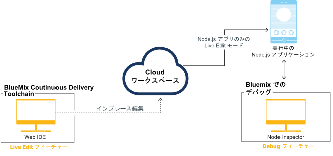

---


copyright:
  years: 2015，2017
lastupdated: "2017-3-10"

---

{:shortdesc: .shortdesc}
{:screen: .screen}
{:new_window: target="_blank"}
{:pre: .pre}

#{{site.data.keyword.Bluemix_notm}} Live Sync 
{: #live-sync}

 
Node.js アプリケーションを作成する場合、{{site.data.keyword.Bluemix}} Live Sync を使用すると、{{site.data.keyword.Bluemix_notm}} 上のアプリケーション・インスタンスを素早く更新して開発することができ、手動で再デプロイする必要がありません。   
{: shortdesc}

変更を行うと、実行中の {{site.data.keyword.Bluemix_notm}} アプリケーションでその変更を即時に確認できます。
{{site.data.keyword.Bluemix_notm}} Live Sync は<!--from both the command line and --> Eclipse Orion Web IDE (Web IDE) で動作します。Node.js で書かれたアプリケーションを {{site.data.keyword.Bluemix_notm}} Live Sync を使用してデバッグできます。  

{{site.data.keyword.Bluemix_notm}} Live Sync は、2 つのフィーチャーで構成されています。
<!-- three -->

<!--
**Desktop Sync**  

You can synchronize any desktop directory tree with a cloud-based project workspace similar to the way Dropbox works. The Web IDE directly edits the same cloud-based workspace, so both stay in sync. Desktop Sync works for any kind of application. To use Desktop Sync, you need to download and install the BL command line interface.  
-->

**Live Edit**

{{site.data.keyword.Bluemix_notm}} で実行中の Node.js アプリケーションに変更を加え、その変更をブラウザーで直ちにテストすることができます。Web IDE 内で加えた変更はすべて、直ちに当該アプリケーションのファイル・システムに伝搬されます。  

**Debug**  

Node.js アプリケーションが Live Edit モードになっている間は、そのアプリケーションにシェルを作成してデバッグできます。Node Inspector というデバッガーを使用して、コードの動的な編集、ブレークポイントの挿入、コードのステップスルー、ランタイムの再始動などを行うことができます。  

<!-- You can use Desktop Sync to keep your desktop workspace in sync with the cloud-based project workspace that you edit directly with the Web IDE. -->

Live Edit を使用して、クラウド・ベースのプロジェクト・ワークスペース内の変更内容を、実行中のアプリケーションに伝搬させることができます。 
<!-- You can use one or both of these features. And if you use Desktop Sync or -->
Live Edit を使用してアプリケーションを Live Edit モードにすると、実行中のアプリケーションをデバッグできます。


Bluemix Live Sync プロセスを以下の図に示します。    

図 1. Bluemix Live Sync プロセス
    



Liberty で実行される Java アプリケーションを開発している場合、[Eclipse Tools for Bluemix](/docs/manageapps/eclipsetools/eclipsetools.html#eclipsetools) を使用してリモートでデバッグすることができます。


##Live Edit {: #live-edit}

Node.js アプリケーションをビルドしている場合、Web IDE を使用してプロジェクトに変更を加えると、{{site.data.keyword.Bluemix_notm}} Live Sync の Live Edit フィーチャーによって、{{site.data.keyword.Bluemix_notm}} で実行中のアプリケーションを素早く更新できます。Live Edit を使用すれば、デスクトップにある場合と同じように再デプロイせずに開発することができます。

Live Edit がサポートされるのは Node.js アプリケーションのみです。

Eclipse Orion Web IDE (Web IDE) の実行バーで、**「Live Edit」**をクリックします。


Live Edit を使用すれば、{{site.data.keyword.Bluemix_notm}} で実行中の Node.js アプリケーションに対する変更を迅速にプレビューできます。Live Edit をオンにしてコードを更新すると、変更を加えてからほんの数秒で、Web アプリケーションのブラウザー・ウィンドウを最新表示して変更が反映されたことを確認できます。

<!--
For a tutorial on using the Live Edit feature of {{site.data.keyword.Bluemix_notm}} Live Sync, see the tutorial [Test and debug a Node.js app with Bluemix Live Sync](https://hub.jazz.net/tutorials/livesync){:new_window}.
-->

Web IDE 内でファイルを変更すると、それらのファイルは {{site.data.keyword.Bluemix_notm}} で実行中のアプリケーションに自動的に再デプロイされます。Node アプリケーションの再始動が必要な場合、実行バーにある **「再始動」**ボタンを使用できます。

**注:** {{site.data.keyword.Bluemix_notm}} Live Sync の Live Edit フィーチャーの使用時に、より一貫性のある動作をさせるためには、256MB の追加メモリーが必要であり、メモリーが追加されます。

##{{site.data.keyword.Bluemix_notm}} Live Debug {: #live-debug}

{{site.data.keyword.Bluemix_notm}} Live Sync が Node.js アプリに対して使用可能になっている場合、{{site.data.keyword.Bluemix_notm}} Live Sync Debug フィーチャーにアクセスできます。

Debug を使用すると、アプリが {{site.data.keyword.Bluemix_notm}} で実行されている間に、コードの動的な編集、ブレークポイントの挿入、コードのステップスルー、ランタイムの再始動などを行うことができます。{{site.data.keyword.Bluemix_notm}} の多数のサービスのリストから選択しながら、アプリを段階的に素早く開発できます。

{{site.data.keyword.Bluemix_notm}} Live Debug には、以下のフィーチャーが含まれています。

* アプリケーション・ランタイム制御
* [node-inspector](https://github.com/node-inspector/node-inspector){:new_window} を使用したデバッグ
* シェル・アクセス

###アプリケーション・ランタイム制御 {: #app-runtime}

アプリケーション・ランタイム制御により、Debug を使用してアプリの開始時の状態を検査することができます。この機能は、始動時に異常終了するアプリをトラブルシューティングする際に役立ちます。

アプリの開発中、次のアクションから選択できます。

* アプリの素早い再始動を実行する。
* アプリのコードが実行される前にアプリを一時停止する。

###Debug {: #debug}

Debug には、以下の機能が含まれています。

**制限:** Google Chrome が必要です。

* アプリ・コードにブレークポイントを設定して、特定の行で実行を一時停止する。
* ブレークポイントの条件を編集して、特定の条件が満たされた場合にのみ実行を一時停止する。
* ローカル変数やフィールドの状態を検査する。
* `console.log()` 呼び出しからのデバッグ出力を即座に表示する。cf ログをモニターするより、このアクションの方がより迅速です。
* 組み込みソース・コード・エディターを使用して、実行中のアプリ・コードに即時 (ただし一時的な) 変更を行う。

###シェル {: #shell}

このツールは、アプリが実行されているコンテナーへのシェル・アクセスを提供します。この端末を使用することにより、診断シェル・コマンドをリモート側で実行してアプリを管理することができます。

標準的な Linux コマンド (**top**、**ps**、および **kill** など) を使用するインスタンス内でメモリーおよび CPU の使用量をモニターします。

###{{site.data.keyword.Bluemix_notm}} Live Debug を使用可能にするためのアプリの構成 {: #configure_app_debug}

アプリは、IBM SDK for Node.js ビルドパックを使用する必要があります。カスタム・ビルドパックはサポートされていません。

1. ビルドパックがアプリの start コマンドを検出できるようにします。start コマンドは、`manifest.yml` ファイル内に設定されるのではなく、ビルドパックによって自動検出される必要があります。  

    a. `package.json` ファイルに、アプリの start コマンドを含む開始スクリプトを含めるようにします。  
    b. アプリの `manifest.yml` ファイルにコマンドが含まれている場合は、それをヌルに設定します。  

2. 環境変数を設定します。  

    a. `manifest.yml` ファイルに次の変数を追加します。
	
	```
	env:
      ENABLE_BLUEMIX_DEV_MODE: "true" 
	```

3. メモリーを増やします。  

    a. アプリの `manifest.yml` ファイルで、メモリー属性に指定されている値に 128M 以上を追加します。

{{site.data.keyword.Bluemix_notm}} Live Debug がインストールされたら、デバッグ・ツールを使用することができます。

アプリをプッシュし、次に `https://app-host.mybluemix.net/bluemix-debug/manage` を参照して、{{site.data.keyword.Bluemix_notm}} デバッグ・ユーザー・インターフェースにアクセスします。認証を求めるプロンプトが出されたら、ユーザー ID と、パーソナル・アクセス・トークンまたは IBM ID のパスワードを入力します。    

<!--
   **Note**: Your user ID for DevOps Services can be either an IBMid or a federated ID (corporate ID). If you use federated authentication, to log in to your Bluemix Live Sync command-line client, you must use a personal access token instead of a password. If you don't use federated authentication, your IBMid and password work with all clients. For more information about creating a personal access token, see [What's federated authentication and how does it affect me?](https://developer.ibm.com/devops-services/2016/06/23/whats-federated-authentication-and-how-does-it-affect-me/){:new_window}
   -->

###アプリ構成の復元および Bluemix Live Debug の使用不可化 {: #restore_live_debug}

1. アプリの `manifest.yml` ファイルから ENABLE_BLUEMIX_DEV_MODE 環境変数を削除します。

2. アプリの、元の start コマンドとメモリー値を復元します。

3. アプリをプッシュします。


## 関連リンク
{: #general}

* [Eclipse tools for Bluemix](https://www.ng.bluemix.net/docs/manageapps/eclipsetools/eclipsetools.html){:new_window}
