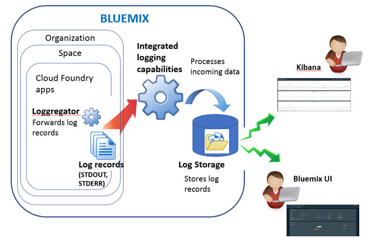

---

copyright:
  years: 2015, 2017

lastupdated: "2017-03-13"

---

{:shortdesc: .shortdesc}
{:new_window: target="_blank"}
{:codeblock: .codeblock}
{:screen: .screen}

# Logging for Cloud Foundry apps in Bluemix
{: #logging_bluemix_cf_apps}

In {{site.data.keyword.Bluemix}}, you can view, filter, and analyze Cloud Foundry (CF) logs through the {{site.data.keyword.Bluemix_notm}} dashboard, Kibana, and the command line interface. In addition, you can stream log records to an external log management tool. 
{:shortdesc}

When you run your apps in a cloud platform-as-a-service (PaaS) like Cloud Foundry on {{site.data.keyword.Bluemix_notm}}, you cannot SSH or FTP into the infrastructure where your apps are running to access the logs. The platform is controlled by the cloud provider. Cloud Foundry apps running on {{site.data.keyword.Bluemix_notm}} use the Loggerator component to forward log records from inside of the Cloud Foundry infrastructure. The Loggregator automatically picks up STDOUT and STDERR data. You can visualize and analyze these logs through the {{site.data.keyword.Bluemix_notm}} dashboard, Kibana, and the command line interface.

The following figure shows a high level view of logging Cloud Foundry apps in {{site.data.keyword.Bluemix_notm}}:

 
Logging of Cloud Foundry apps is automatically enabled when you use the Cloud Foundry infrastructure to run your apps on {{site.data.keyword.Bluemix_notm}}. To view Cloud Foundry runtime logs, you must write your logs to STDOUT and STDERR. For more information, see [Runtime application logging through CF apps](cfapps/logging_writing_to_log_from_cf_app.html#logging_writing_to_log_from_cf_app).

{{site.data.keyword.Bluemix_notm}} keeps a limited amount of log information. When information is logged, the old information is replaced by the newer information. If you have to comply with organizational or industry policies that require you to keep part or all the log information for audit or other purposes, you can stream your logs to an external log host, such as a third-party log management service or other host. For more information, see [Configuring external log hosts](logging_view_external.html#viewing_logs_external).

## Methods to analyze CF app logs
{: #logging_bluemix_cf_apps_log_methods}

You can choose any of the following methods to analyze the logs of your Cloud Foundry application:

* Analyze the log in {{site.data.keyword.Bluemix_notm}} to view the latest actvity of the application.
    
    In {{site.data.keyword.Bluemix_notm}}, you can view, filter, and analyze logs through the **Log** tab that is available for each Cloud Foundry application. For more information, see [Analyzing CF app logs from the Bluemix dashboard](logging_view_dashboard.html#analyzing_logs_bmx_ui).
    
* Analyze logs in Kibana to perform advanced analytical tasks.
    
    In {{site.data.keyword.Bluemix}}, you can use Kibana, an open source analytics and visualization platform, to monitor, search, analyze, and visualize your data in a variety of graphs, for example charts and tables. For more information, see [Analyzing logs in Kibana](kibana4/logging_analyzing_logs_Kibana.html#analyzing_logs_Kibana).

* Analyze logs through the CLI to use commands to manage logs programmatically.
    
    In {{site.data.keyword.Bluemix}}, you can view, filter, and analyze logs through the command line interface by using the **cf logs** command. For more information, see [Analyzing Cloud Foundry app logs from the command line interface](logging_view_cli.html#analyzing_logs_cli).

## Log sources for CF apps
{: #logging_bluemix_cf_apps_log_sources}

For Cloud Foundry (CF) applications, the following log sources are available:
    
| Log source | Component name | Description | 
|------------|----------------|-------------|
| LGR | Loggregator | The LGR component provides information about the Cloud Foundry Loggregator, which forwards logs from inside of Cloud Foundry. |
| RTR | Router | The RTR component provides information about HTTP requests to an application. | 
| STG | Staging | The STG component provides information on how an application is staged or restaged. | 
| APP | Application | The APP component provides logs from the application. This is where stderr and stdout in your code will show up. | 
| API | Cloud Foundry API | The API component provides information about the internal actions that result from a user's request to change the state of an application. | 
| DEA | Droplet Execution Agent | The DEA component provides information about the start, stop, or crash of an application.   This component is only available if your application is deployed in the Cloud Foundry architecture that is based on DEA. | 
| CELL | Diego cell | The CELL component provides information about the start, stop, or crash of an application.   This component is only available if your application is deployed in the Cloud Foundry architecture that is based on Diego.|
| SSH | SSH | The SSH component provides information every time a user accesses an application by using the **cf ssh** command. This component is only available if your application is deployed in the Cloud Foundry architecture that is based on Diego. |

The following figure shows the different components (log sources) in a Cloud Foundry architecture that is based on the Droplet Execution Agent (DEA): 
 in a Cloud Foundry architecture that is based on the Droplet Execution Agent (DEA).")

