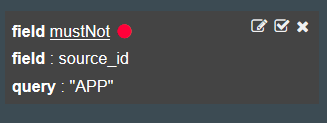

---

copyright:
  years: 2016, 2017
lastupdated: "2017-02-06"

---

<!-- Common attributes used in the template are defined as follows: -->
{:new_window: target="_blank"}
{:shortdesc: .shortdesc}
{:screen:.screen}
{:codeblock:.codeblock}

# Protokolle für Cloud Foundry-Apps nach Protokolltyp in Kibana filtern
<!-- for example, Uploading your data -->
{: #logging_kibana_component_filter}
<!-- Provide an appropriate ID above -->

Sie können Protokolle für {{site.data.keyword.Bluemix_notm}}-Anwendungen nach Komponente (Protokolltyp) im Kibana-Dashboard anzeigen und filtern. Sie können über die Registerkarte **Protokolle** für Ihre Cloud Foundry-App auf das Kibana-Dashboard zugreifen. 
{:shortdesc}

<!-- Include a sentence to briefly introduce the steps/subtopics. Example: -->
Führen Sie die folgenden Tasks aus, um Ihre Cloud Foundry-App-Protokolle nach Protokolltyp im Kibana-Dashboard anzuzeigen und zu filtern:

1. Greifen Sie auf die Registerkarte **Protokolle** Ihrer Cloud Foundry-App zu. 

    1. Klicken Sie auf den App-Namen im {{site.data.keyword.Bluemix_notm}}-Dashboard **Apps**.
    2. Klicken Sie auf die Registerkarte **Protokolle**. 
    
    Die Protokolle für Ihre App werden angezeigt.

2. Greifen Sie auf das Kibana-Dashboard für Ihre App zu. Klicken Sie auf **Erweiterte Ansicht** . Das Kibana-Dashboard wird angezeigt.

3. Klicken Sie im Fenster **ALL EVENTS** auf das Rechtspfeilsymbol, um alle Felder anzuzeigen. 

    

4. Wählen Sie im Teilfenster **Fields** die Option **source_id** aus, um die Komponente anzuzeigen, die den jeweiligen Protokolleintrag im Fenster **ALL EVENTS** generiert hat.

    

5. Klicken Sie im Fenster **ALL EVENTS** auf eine Protokollereigniszeile, um die Details für dieses Ereignis anzuzeigen. Wählen Sie ein Ereignis aus, das den Wert für 'source_id' anzeigt, nach dem Sie filtern wollen.

    

6. Fügen Sie einen Filter hinzu, um Informationen für eine Komponente (Protokolltyp) ein- oder auszuschließen. 

    * Zum Hinzufügen eines Filters, der einen Komponentenwert einschließt, klicken Sie auf das **Lupensymbol**  in der Zeile 'source_id' der Tabelle. 

         

    * Zum Hinzufügen eines Filters, der einen Komponentenwert ausschließt, klicken Sie auf das **Ausschlusssymbol**  in der Zeile 'source_id' der Tabelle. 
    
          
     
     Im Kibana-Dashboard wird eine neue Filterbedingung hinzugefügt.

7. Sie können den vorherigen Schritt optional wiederholen und Filter für jede Komponente hinzufügen. Eine vollständige Liste der Komponenten finden Sie unter [Protokollformat](../logging_view_kibana3.html#kibana_log_format_cf).

    Die folgende Abbildung zeigt das Dashboard mit mehreren Filtern für verschiedene Komponenten:
    
    

8. Speichern Sie das Dashboard. 

    Wenn Sie die gewünschten Filter hinzugefügt und die Anpassung des Dashboards abgeschlossen haben, klicken Sie auf das Symbol **Speichern**  und geben einen Namen für Ihr Dashboard ein. 
      
    **Hinweis:** Wenn Sie versuchen, ein Dashboard unter einem Namen zu speichern, der Leerzeichen enthält, wird es nicht gespeichert. Geben Sie einen Namen ohne Leerzeichen ein und klicken Sie auf das Symbol **Speichern**.
    
    

Sie haben jetzt ein Dashboard erstellt, das Ihre Protokolleinträge nach Komponente (Protokolltyp) filtert. Sie können Ihr gespeichertes Dashboard jederzeit laden, indem Sie auf das Symbol **Ordner**  klicken und Ihr Dashboard über den Namen auswählen.

