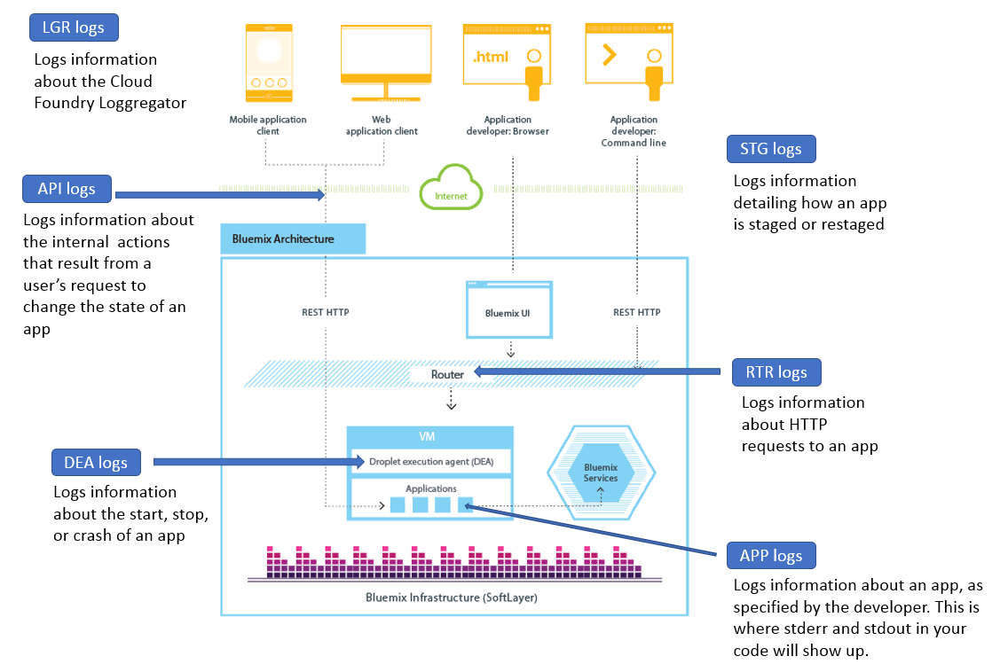

---

copyright:
  years: 2015, 2017

lastupdated: "2017-02-06"

---

{:shortdesc: .shortdesc}
{:new_window: target="_blank"}
{:codeblock: .codeblock}
{:screen: .screen}

# Analyse des journaux d'application CF dans le tableau de bord Bluemix
{: #analyzing_logs_bmx_ui}

Dans {{site.data.keyword.Bluemix}}, vous pouvez visualiser, filtrer et analyser des journaux via l'onglet **Journal** disponible pour chaque application Cloud Foundry. Utilisez le tableau de bord {{site.data.keyword.Bluemix}} pour visualiser la dernière activité de l'application.
{:shortdesc}

{{site.data.keyword.Bluemix_notm}} public offre un service de journalisation intégré. Lorsque vous exécutez vos applications dans Cloud Foundry, le service de journalisation capture des données de journal relatives à votre application à partir des composants système qui interagissent avec votre application et même des données de journal au sein de votre application lorsque vous utilisez des sorties standard et des erreurs standard.

Les journaux des applications {{site.data.keyword.Bluemix_notm}} sont affichés dans un format fixe similaire au modèle suivant :

<code><var class="keyword varname">Component</var>/<var class="keyword varname">instanceID</var>     <var class="keyword varname">message</var>     <var class="keyword varname">timestamp</var></code>
   
Pour plus d'informations sur le format de journal, voir [Format de journal des journaux d'application Cloud Foundry](logging_view_dashboard.html#log_format_cf).

**Remarque :** dans {{site.data.keyword.Bluemix_notm}} public, les données de journal sont stockées pendant 7 jours par défaut. Vous pouvez rechercher jusqu'à 1 Go de données par jour.

##  Obtention de l'onglet Journal Bluemix
{: #launch_logs_tab_bmx_ui}

Pour afficher les journaux de déploiement ou d'exécution d'une application Cloud Foundry, procédez comme suit :

1. Connectez-vous à {{site.data.keyword.Bluemix_notm}}, puis cliquez sur le nom d'application dans le tableau de bord {{site.data.keyword.Bluemix_notm}} **Applications**. 

    La page des détails d'application s'affiche.
    
2. Dans la barre de navigation, cliquez sur **Journaux**.

    L'onglet Journaux s'affiche. 
    
    Dans l'onglet **Journaux**, vous pouvez afficher les journaux récents pour votre application ou afficher les dernières lignes des journaux en temps réel. De plus, vous pouvez filtrer les journaux par composant (type de journal), par ID d'instance d'application et par erreur.

## Format de journal des journaux d'application Cloud Foundry
{: #log_format_cf}

Chaque entrée de journal contient les zones suivantes :

<dl>
<dt><strong>Horodatage</strong></dt>
<dd>

Date et heure de l'instruction de journal. L'horodatage est défini à la milliseconde près.

</dd>

<dt><strong>Composant</strong></dt>
<dd>
<pre class="pre screen"><code>[App/0]</code></pre>

Composant qui génère le journal. 

Chaque type de composant est suivi d'une barre oblique et d'un chiffre qui indique l'instance d'application. 0 est le chiffre attribué à la première instance, 1 est le chiffre attribué à la  deuxième instance, etc. Notez que vous pouvez effectuer un filtrage afin d'afficher une seule instance d'application dans le tableau de bord.

La liste suivante décrit les différents types de composants :

<dl>
<dt><strong>LGR</strong></dt>
<dd>Loggregator : le composant LGR fournit des informations sur Cloud Foundry Loggregator, qui achemine des journaux à partir de Cloud Foundry.</dd>

<dt><strong>RTR</strong></dt>
<dd>Routeur : le composant RTR fournit des informations sur les demandes HTTP émises vers une application.</dd>

<dt><strong>STG</strong></dt>
<dd>Constitution : le composant STG fournit des informations sur la façon dont une application est constituée ou reconstituée.</dd>

<dt><strong>APP</strong></dt>
<dd>Application : le composant APP fournit des journaux à partir de l'application. C'est là que la sortie standard et l'erreur standard de votre code apparaîtront.
</dd>

<dt><strong>interface API</strong></dt>
<dd>API Cloud Foundry : le composant API fournit des informations sur les actions internes qui résultent de la demande d'un utilisateur pour modifier l'état d'une application.</dd>

<dt><strong>DEA</strong></dt>
<dd>Agent DEA (Droplet Execution Agent) : le composant DEA fournit des informations sur le démarrage, l'arrêt ou la panne d'une application. 

Ce composant est disponible uniquement si votre application est déployée dans l'architecture Cloud Foundry qui est basée sur DEA.
</dd>

<dt><strong>CELL</strong></dt>
<dd>Cellule Diego : le composant CELL fournit des informations sur le démarrage, l'arrêt ou la panne d'une application. 

Ce composant est disponible uniquement si votre application est déployée dans l'architecture Cloud Foundry qui est basée sur Diego.
</dd>

<dt><strong>SSH</strong></dt>
<dd>SSH : le composant SSH fournit des informations chaque fois qu'un utilisateur accède à une application à l'aide de la commande **cf ssh**. 

Ce composant est disponible uniquement si votre application est déployée dans l'architecture Cloud Foundry qui est basée sur Diego.
</dd>

</dl>
</dd>

<dt><strong>Message</strong></dt>
<dd>
<pre class="pre screen"><code>&lt;<var class="keyword varname">Message</var>&gt;</code></pre>

Message émis par le composant. Il varie selon le contexte.

</dd>
</dl>

L'illustration suivante présente les différents composants (types de journal) dans une architecture Cloud Foundry qui est basée sur Droplet Execution Agent (DEA) : 

