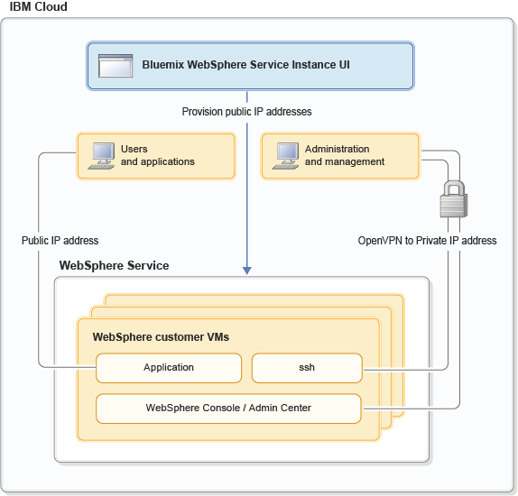

---

copyright:
  years: 2015, 2016
lastupdated: "2016-10-28"

---

{:shortdesc: .shortdesc}
{:new_window: target="_blank"}
{:codeblock: .codeblock}

# Ambiente di rete
{: #networkEnvironment}

Dopo aver eseguito il provisioning della tua istanza del servizio WebSphere Application Server for {{site.data.keyword.Bluemix_notm}}, puoi accedere alla tua VM in diversi modi. Puoi collegarti tramite una VPN sicura per ottenere l'accesso SSH, alla console di gestione WebSphere tradizionale e all'applicazione per la tua VM. Puoi anche collegare la tua VM a internet con un indirizzo IP pubblico.

Il seguente diagramma illustra questi percorsi di rete:

Figura 1. Vista client di una rete a più tenant con IP pubblico



## Accesso VPN
{: #vpnAccess}

Dopo aver eseguito il provisioning di un'istanza del servizio di WebSphere Application Server for {{site.data.keyword.Bluemix_notm}} dal dashboard del servizio nella IU {{site.data.keyword.Bluemix_notm}}, puoi scaricare la tue credenziali VPN e stabilire una connessione OpenVPN. Puoi quindi accedere alla tue VM tramite SSH. Puoi anche accedere al Liberty Admin Center, alla console di gestione WebSphere tradizionale e alle applicazioni.

## Accesso internet pubblico
{: #publicInternetAccess}

Facoltativamente, puoi richiedere un indirizzo IP pubblico per la tua VM del server WebSphere facendo clic su **Gestisci IP pubblico** nel dashboard del servizio nella IU {{site.data.keyword.Bluemix_notm}} e richiedere un IP pubblico. Questo processo riserva l'indirizzo IP pubblico per questo server. Quindi, fai clic su **Apri IP** per aprire la connessione da internet alla tua istanza del servizio di WebSphere Application Server for {{site.data.keyword.Bluemix_notm}}.

## Porte IP pubblico
{: #publicIPports}

Quando apri l'accesso al tuo IP pubblico, l'indirizzo IP viene associato alla tua VM e le porte 80 e 443 vengono aperte al gateway. Tuttavia, per impostazione predefinita, i server Liberty Core e WebSphere Base tradizionale non aprono le porte 80 e 443. Al contrario, le porte 80 e 443 sono aperte per impostazione predefinita su IBM HTTP Server. Pertanto, potresti dover configurare i tuoi server Liberty Core e WebSphere Base tradizionale per ascoltare il traffico dell'applicazione sulla porta 80/443 quando utilizzi un IP pubblico.
* Per configurare il tuo server Liberty Core, consulta [Configurare il server Liberty Core per l'accesso pubblico](networkEnvironment.html#configureLibertyForPublicAccess).
* Per configurare il tuo server WebSphere Base tradizionale, aggiungi una catena di trasporto del contenitore web in ascolto sulla porta 80/443 come descritto in [Configurazione delle catene di trasporto](http://www.ibm.com/support/knowledgecenter/SSEQTP_8.5.5//com.ibm.websphere.nd.doc/ae/trun_chain_transport.html){: new_window}.

## Porte IP privato VPN
{: #privateIPports}

Collega il tuo indirizzo IP privato della VM tramite la connessione VPN. Liberty Admin Center (9080, 9443), la console di gestione WebSphere tradizionale (9060, 9043), SSH (22) e le porte diverse da 80/443 sono accessibili solo tramite la connessione VPN come rappresentato nella Figura 1. Consulta il Liberty Core di esempio **server.xml** e **ibm-web-bnd.xml** per i dettagli sulla separazione di Liberty Admin Center dalle tue porte dell'applicazione.

**Prevenzione dei problemi:** per i server Liberty Core e WebSphere Base tradizionale, le porte del firewall sono pre-configurate quando esegui il provisioning della tua VM. Tuttavia, per le configurazioni di Network Deployment in cui il Deployment manager o il Collective controller viene collocato con il IBM HTTP Server, potresti dover aprire le porte nel firewall. Consulta [Porte firewall](systemAccess.html#firewall_ports) per i dettagli.

## Configurazione del server Liberty Core per l'accesso IP pubblico
{: #configureLibertyForPublicAccess}

Devi configurare Liberty Core per ascoltare il traffico dell'applicazione sulla porta 80/443 quando utilizzi l'IP pubblico.

Per impostazione predefinita, Liberty è configurato con il Liberty Admin Center e le applicazioni disponibili nell'host virtuale **default_host**, associato a **defaultHttpEndpoint** nella porta 9080 e 9443. Riconfigura il tuo server per separare il Liberty Admin Center dall'endpoint e dall'host virtuale dell'applicazione e rendili disponibili su porte diverse.

Il seguente frammento è un esempio di modifiche di configurazione server.xml:

```    
    <!-- open port 9080/9443 for incoming http connections -->
    <httpEndpoint id="defaultHttpEndpoint"
        host="*"
        httpPort="9080"
        httpsPort="9443">
        <tcpOptions soReuseAddr="true"/>
    </httpEndpoint>

    <!-- define a new endpoint for public app traffic -->
    <httpEndpoint id="publicHttpEndpoint"
        host="*"
        httpPort="80"
        httpsPort="443">
        <tcpOptions soReuseAddr="true"/>
    </httpEndpoint>

    <!– restrict default_host to vpn so the Liberty Admin Center is not public -->
    <virtualHost id="default_host" allowFromEndpointRef="defaultHttpEndpoint">
      <hostAlias>*:9080</hostAlias>
      <hostAlias>*:9443</hostAlias>
    </virtualHost>

    <virtualHost id="external_host">
      <hostAlias>*:80</hostAlias>
      <hostAlias>*:443</hostAlias>
    </virtualHost>
```
{: codeblock}

Ora associa la tua applicazione con l'host virtuale **external_host** includendo il seguente frammento nel file **META-INF/ibm-web-bnd.xml** della tua applicazione:

```
    <?xml version="1.0" encoding="UTF-8"?>
    <web-bnd
        xmlns="http://websphere.ibm.com/xml/ns/javaee"
        xmlns:xsi="http://www.w3.org/2001/XMLSchema-instance"
        xsi:schemaLocation="http://websphere.ibm.com/xml/ns/javaee   
        http://websphere.ibm.com/xml/ns/javaee/ibm-web-bnd_1_0.xsd"
        version="1.0">

        <virtual-host name="external_host" />
    </web-bnd>
```
{: codeblock}
