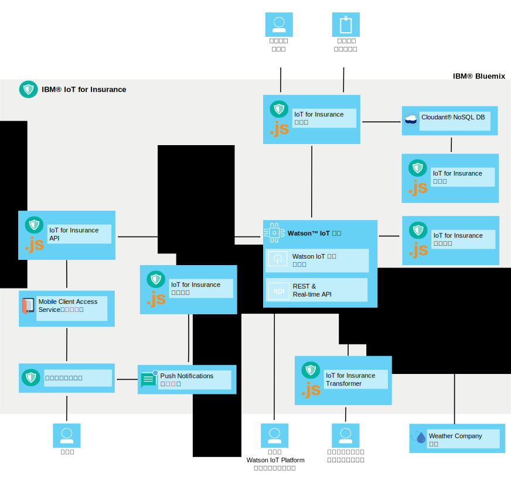

---

copyright:
  years: 2016, 2017
lastupdated: "2017-03-08"
---

<!-- Common attributes used in the template are defined as follows: -->
{:new_window: target="blank"}
{:shortdesc: .shortdesc}
{:screen: .screen}
{:codeblock: .codeblock}
{:pre: .pre}

# 关于 {{site.data.keyword.iotinsurance_short}} 
{: #about}

{{site.data.keyword.iotinsurance_full}} 是集成的 IoT 生产实例，该实例收集和分析保单持有者的全部上下文数据以提供个性化的风险评估、实时保护并降低保单成本。
{: shortdesc}

{{site.data.keyword.iotinsurance_short}} 提供保单持有者资产和情况的全部上下文视图，包括的信息有位置、天气、交通和整体运行状况。对这些信息进行深度分析可使承保人能够为保单持有者提供个性化风险评估和实时保护。对保单持有者的益处包括通过早期警报避免风险，提供个性化建议和简化理赔流程和结算。对承包人的益处包括客户满意度、客户忠诚，以及通过避免理赔和自动化结算来降低费用。

## 体系结构
{: #architecture}

{{site.data.keyword.iotinsurance_short}} 组件可一起使用，如本部分中所述。此组织还会显示在体系结构图中。{{site.data.keyword.iotinsurance_short}} 仪表板可显示存储在 {{site.data.keyword.iot_short_notm}} 和 {{site.data.keyword.cloudantfull}} 数据库中的数据。用户智能设备可通过云或直接连接到 {{site.data.keyword.iot_short_notm}}。如果通过云连接，那么它们会向 Transformer 发送数据，Transformer 对数据进行处理后，再将其发送到 {{site.data.keyword.iot_short_notm}}。来自 {{site.data.keyword.weatherfull}} 的数据还可以拉入到 {{site.data.keyword.iotinsurance_short}} Weather Company Data Transformer 并从那里拉入到 {{site.data.keyword.iot_short_notm}}。数据由保障引擎进行处理，该引擎会生成保障事件，并通过 API 发送到操作引擎。操作引擎可以选择使用 {{site.data.keyword.mobilepushfull}} 将通知发送到用户的移动应用程序。用户还可以使用移动应用程序来响应警报或报价。

**注**：{{site.data.keyword.iotinsurance_short}} 的较早版本使用 {{site.data.keyword.amafull}} 服务处理响应并通过 API 将它们返回到 {{site.data.keyword.iot_short_notm}}，然后返回到 {{site.data.keyword.iotinsurance_short}} 仪表板。此处理会针对较早版本的 {{site.data.keyword.iotinsurance_short}} 实例继续运作。但是，{{site.data.keyword.iotinsurance_short}} 的新实例不包括 {{site.data.keyword.amashort}} 或 {{site.data.keyword.mobilepushshort}}。要使用移动应用程序，您必须创建定制验证流程。您还可以选择创建 [{{site.data.keyword.mobilepushshort}} 实例](../mobilepush/index.html)，并将其绑定到 API 以启用推送通知。

## 保险仪表板
{: #insurance_dashboard}
保险仪表板向保险公司用户（例如，代理）提供客户承保资产现状的完整视图。他们可以看到国家或地区、省/直辖市/自治区或帐户级别的保障和事件。

样本保险仪表板装入了模拟数据，以显示您可以收集和分析的信息类型的示例。

## 样本移动应用程序
{: #mobileapp}
保单持有者（例如，房主）使用样本移动应用程序查看和响应 {{site.data.keyword.iotinsurance_short}} 从其家中的传感器发送的信息。

使用移动设备，房主授权服务连接到传感器提供者的云中，以发送和接收数据。例如，当传感器检测到漏水时，房主可在移动 Starter 应用程序中接收到通知。有关更多信息，请参阅[安装和连接样本移动应用程序](iotinsurance_mobile_app.html)。

## REST 和实时 API
{: #rest_api}
移动 Starter 应用程序、保险仪表板、保障引擎和危险控制器使用 REST API。通过 REST API，用户可以得知设备与保障和操作之间的关联。使用 API，程序员可以创建新用户，生成事件数据，创建和注册新保障，以及访存事件数据。

您从服务控制台访问的 API 是为您的 {{site.data.keyword.iotinsurance_short}} 实例定制的。

在 API 页面，您可以  
  - 查看所有可用的 API 调用和关联的文档。
  - 尝试使用各个 API 调用。选择 API 调用以显示所有信息，然后单击**试试看！**。

API 示例可用于帮助您初步使用常见的方案。有关更多信息，请参阅 [{{site.data.keyword.iotinsurance_short}} API 示例](https://github.com/IBM-Bluemix/iot4i-api-examples-nodejs)。

## Transformer
{: #transformer}
Transformer 向云服务器 API 请求新信息，并转换信息以匹配 {{site.data.keyword.iotinsurance_short}} 中的数据。然后，发布数据以供后面的 {{site.data.keyword.iotinsurance_short}} 实施使用。用户必须授权 Transformer 组件访问传感器云数据和处理记录的数据。{{site.data.keyword.iotinsurance_short}} 支持多个云供应商和设备。有关受支持云供应商的列表以及如何将设备连接到 {{site.data.keyword.iotinsurance_short}} 的指示信息，请参阅[受支持的设备和供应商](iotinsurance_supporteddevices.html)。

## Weather Company Data Transformer
{: #wcdtransformer}
Weather Company 应用程序会将 Weather Company 数据服务的相关天气数据注入到 IoT4I 数据流。随后，此数据可用于构建启用天气的保障。

**注**：支持 Weather Company Data Transformer 仅作为概念验证或技术预览，不用作生产目的。

## 保障引擎
{: #shield_engine}
保障引擎根据事件中存储的信息，确定是否发生了漏水等危险。如果发现危险，就传递给操作引擎。

保障是客户从保险提供者获取的特定保护。例如，房主对房屋购买保险，以保障火灾、浸水、抢劫和其他危险对房屋带来的损失。{{site.data.keyword.iotinsurance_short}} 解决方案提供内置的水灾保障。当与水相关的事件危及他们的房屋时，将向客户发出警报，客户可以进行响应。使用 REST API，开发人员可以添加更多保障。
  

保障在 {{site.data.keyword.iotinsurance_short}} 分析引擎中运行。分析引擎识别危险类型（例如，*检测到水灾*）、发送危险的传感器的用户帐户以及与帐户相关的保障。可以根据该信息采取操作。您可以使用或修改 {{site.data.keyword.iotinsurance_short}} 保障库中包含的保障，或者您可以创建并实施自己的保障。
有关保障和 [{{site.data.keyword.iotinsurance_short}} 保障库 ](https://github.com/ibm-watson-iot/ioti-shields){: new_window} 的更多信息，请参阅[保障工具包](iotinsurance_shield_toolkit.html)。

## 操作引擎
{: #action_engine}
操作引擎根据保障中指定的信息确定要采取的操作。

您可以使用 {{site.data.keyword.iotinsurance_short}} API 在 JavaScript 中创建新保障。

# 相关链接
{: #rellinks}

## 教程和样本
{: #samples}
* [GitHub 上的样本移动应用程序代码 ](https://github.com/ibm-watson-iot/ioti-mobile){:new_window}

## API 参考
{: #api}
* [{{site.data.keyword.iotinsurance_short}} API ](https://iot4i-api-docs.mybluemix.net/){:new_window}
* [{{site.data.keyword.iotinsurance_short}}API 示例 ](https://github.com/IBM-Bluemix/iot4i-api-examples-nodejs/#iot-for-insurance-api-examples){:new_window}

## 相关链接
{: #general}
* [{{site.data.keyword.iot_full}}文档](https://console.ng.bluemix.net/docs/services/IoT/index.html){:new_window}
* [开发人员支持论坛 ](https://developer.ibm.com/answers/search.html?f=&type=question&redirect=search%2Fsearch&sort=relevance&q=%2B[iot]%20%2B[bluemix]){:new_window}
* [堆栈溢出支持论坛 ](http://stackoverflow.com/questions/tagged/ibm-bluemix){:new_window}
