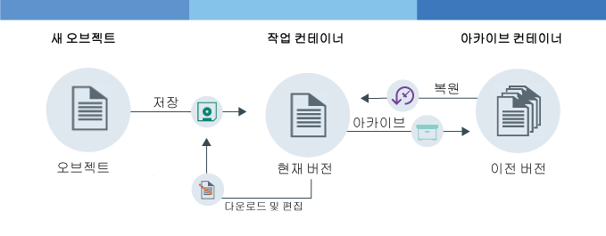

---

copyright:
  years: 2014, 2017
lastupdated: "2017-02-10"

---
{:new_window: target="_blank"}
{:shortdesc: .shortdesc}
{:codeblock: .codeblock}
{:screen: .screen}
{:pre: .pre}


# 오브젝트 버전화 설정 {: #setting-up-versioning}

오브젝트 버전화를 설정하여 오브젝트의 이전 버전을 자동으로 유지할 수 있습니다. 버전화를 사용하면, 의도치 않게 겹쳐쓰기되는 경우를 방지하고 파일의 이전 버전을 검색할 수 있습니다.
{: shortdesc}


#### 오브젝트 버전화의 작동 방식

오브젝트 버전화는 변경될 가능성이 있는 오브젝트를 사용자가 저장할 수 있도록 합니다. 버전화를 사용하면, 오브젝트의 최신 버전을 작업 컨테이너에서 항상 사용할 수 있으며 모든 이전 버전이 아카이브 컨테이너에 백업됩니다. 

<dl>
  <dt>저장</dt>
    <dd>새 오브젝트는 처음으로 저장하는 오브젝트입니다. 이 오브젝트는 새로운 오브젝트이거나 두 번째로 업로드하는 편집된 오브젝트일 수 있습니다. </dd>
  <dt>아카이브</dt>
    <dd>버전화를 사용하면, 기존 오브젝트와 동일한 이름의 오브젝트가 작업 컨테이너에 저장되는 경우, 이전 오브젝트는 아카이브 컨테이너로 이동됩니다. 시간소인이 오브젝트 이름에 추가됩니다. </dd>
  <dt>복원</dt>
    <dd>작업 컨테이너에서 오브젝트가 삭제되고 해당 오브젝트의 아카이브된 버전이 존재하는 경우, 아카이브된 버전이 복원됩니다. 언제든지 아카이브된 오브젝트를 복원할 수 있습니다. </dd>
</dl>



그림 1. 오브젝트 버전화 개요


#### 튜토리얼

오브젝트 버전화를 이해하려면 다음 튜토리얼을 완료하십시오. 

1. 컨테이너를 작성하고 이름을 지정하십시오. *container_name* 변수를 컨테이너에 지정할 이름으로 대체하십시오. 

    ```
    swift post <container_name>
    ```
    {: pre}

2. 백업 스토리지 역할을 할 두 번째 컨테이너를 작성하고 이름을 지정하십시오. 

    ```
    swift post <archive_container_name>
    ```
    {: pre}

3. 버전화를 설정하십시오. 

    Swift 명령:

    ```
    swift post <container_name> -H "X-Versions-Location: <archive_container_name>"
    ```
    {: pre}

    cURL 명령:

    ```
    curl -i -X PUT -H "X-Auth-Token: <token>" -H "X-Versions-Location:<archive_container_name>" https://<object-storage_url>/<container_name>
    ```
    {: pre}

4. 처음으로 작업 컨테이너에 오브젝트를 업로드하십시오. 

    ```
    swift upload <container_name> <object>
    ```
    {: pre}

5. 오브젝트에 대해 편집하고 새 버전을 작업 컨테이너에 업로드하십시오. 

    ```
    swift upload <container_name> <object>
    ```
    {: pre}

6.  아카이브 컨테이너의 오브젝트는 `<Length><Object_name>/<time stamp>` 형식으로 이름이 자동 지정됩니다.
    <table>
    <caption> 표 1. 이름 지정 속성 설명</caption>
      <tr>
        <th> 속성 </th>
        <th> 설명 </th>
      </tr>
      <tr>
        <td> <i>Length</i> </td>
        <td> 오브젝트 이름의 길이입니다. 3자의 영(0)으로 채워진 16진수입니다. </td>
      </tr>
      <tr>
        <td> <i>Object_name</i> </td>
        <td> 오브젝트 이름입니다. </td>
      </tr>
      <tr>
        <td> <i> time stamp </i> </td>
        <td> 오브젝트의 해당 버전이 처음 업로드된 때의 시간소인입니다. </td>
      </tr>
    </table>

7. 작업 컨테이너의 오브젝트를 나열하여 파일의 새 버전을 확인하십시오. 

    ```
    swift list --lh <container_name>
    ```
    {: pre}

8. 아카이브 컨테이너의 오브젝트를 나열하여 시간소인이 추가된 파일의 이전 버전을 확인하십시오. 

    ```
    swift list --lh <backup_container_name>
    ```
    {: pre}

9. 작업 컨테이너에서 오브젝트를 삭제하십시오. 아카이브 컨테이너의 최신 버전이 작업 컨테이너로 자동 복원됩니다. 

    **참고**: 오브젝트를 삭제하기 위해서는 파일의 모든 버전을 삭제해야 합니다. 

    ```
    swift delete <container_name> <object>
    ```
    {: pre}

10. 선택사항: 오브젝트 버전화의 사용을 해제하십시오. 

    Swift 명령:

    ```
    swift post <container_name> -H "X-Remove-Versions-Location:"
    ```
    {: pre}

    cURL 명령:

    ```
    cURL -i -X POST -H "X-Auth-Token: <token>" -H "X-Remove-Versions-Location: anyvalue" https://<object-storage_url>/<container_name>
    ```
    {: pre}
