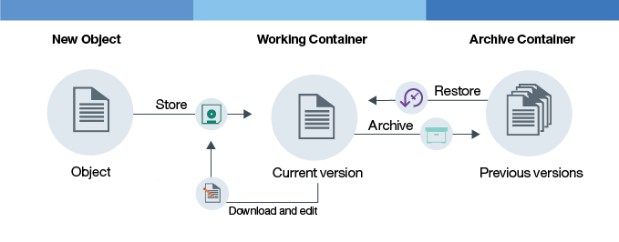

---

copyright:
  years: 2014, 2017
lastupdated: "2017-02-23"

---
{:new_window: target="_blank"}
{:shortdesc: .shortdesc}
{:codeblock: .codeblock}
{:screen: .screen}
{:pre: .pre}


# Setting up object versioning {: #setting-up-versioning}

You can keep older versions of your objects automatically, by setting up object versioning. With versioning, you can prevent unintentional overwrites and retrieve previous versions of your files.
{: shortdesc}


## How object versioning works

Object versioning is a way for a user to store an object that might change. With versioning, the current version of your object is always available in your working container, and all previous versions are backed up in your archive container.

<dl>
  <dt>Store</dt>
    <dd>A new object is an object that you are storing for the first time. This object can be a brand new object, or an edited object that you are uploading for the second time.</dd>
  <dt>Archive</dt>
    <dd>With versioning, when an object with the same name as an existing object is saved to the working container, the older object is moved to the archive container. A time stamp is appended to the name of the object.</dd>
  <dt>Restore</dt>
    <dd>If an object is deleted from the working container and an archived version of that object exists, the archived version is restored.  You can restore an archived object, at any time.</dd>
</dl>



Figure 1. Object versioning overview


#### Tutorial

To understand object versioning, complete the following tutorial.

1. Create a container and give it a name. Replace the variable *container_name* with the name you want to give your container.

    ```
    swift post <container_name>
    ```
    {: pre}

2. Create a second container to act as your backup storage and give it a name.

    ```
    swift post <archive_container_name>
    ```
    {: pre}

3. Set up versioning.

    Swift command:

    ```
    swift post <container_name> -H "X-Versions-Location: <archive_container_name>"
    ```
    {: pre}

    cURL command:

    ```
    curl -i -X PUT -H "X-Auth-Token: <token>" -H "X-Versions-Location:<archive_container_name>" https://<object-storage_url>/<container_name>
    ```
    {: pre}

4. Upload an object to your working container for the first time.

    ```
    swift upload <container_name> <object>
    ```
    {: pre}

5. Edit to your object and upload the new version to your working container.

    ```
    swift upload <container_name> <object>
    ```
    {: pre}

6.  The object in your archive container is automatically named with the following format: `<Length><Object_name>/<time stamp>`.
    <table>
    <caption> Table 1. Naming attributes described </caption>
      <tr>
        <th> Attribute </th>
        <th> Description </th>
      </tr>
      <tr>
        <td> <i> Length </i> </td>
        <td> The length of the name of your object. This is a 3-character, zero-padded hexadecimal number. </td>
      </tr>
      <tr>
        <td> <i> Object_name </i> </td>
        <td> The name of your object. </td>
      </tr>
      <tr>
        <td> <i> time stamp </i> </td>
        <td> The time stamp of when that version of the object was originally uploaded. </td>
      </tr>
    </table>

7. List the objects in your working container to see the new version of your file.

    ```
    swift list --lh <container_name>
    ```
    {: pre}

8. List the objects in your archive container to see the previous version of your file with an appended time stamp.

    ```
    swift list --lh <backup_container_name>
    ```
    {: pre}

9. Delete the object in your working container. The most recent version in your archive container is automatically restored to your working container.

    **Note**: You must delete all versions of your file in order for the object to be deleted.

    ```
    swift delete <container_name> <object>
    ```
    {: pre}

10. Optional: Disable object versioning.

    Swift command:

    ```
    swift post <container_name> -H "X-Remove-Versions-Location:"
    ```
    {: pre}

    cURL command:

    ```
    cURL -i -X POST -H "X-Auth-Token: <token>" -H "X-Remove-Versions-Location: anyvalue" https://<object-storage_url>/<container_name>
    ```
    {: pre}
