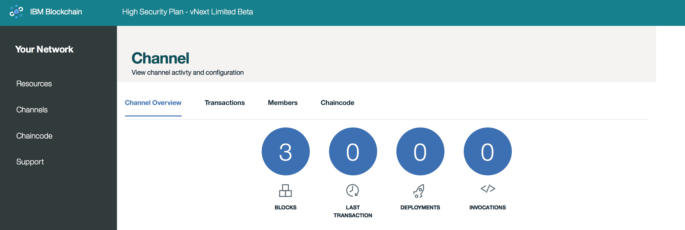

---

copyright:
  years: 2017

---

{:new_window: target="_blank"}
{:shortdesc: .shortdesc}
{:codeblock: .codeblock}
{:screen: .screen}
{:pre: .pre}

# Kanäle
{: #v10_dashboard}
Letzte Aktualisierung: 16. März 2017
{: .last-updated}

Kanäle sind ein äußerst leistungsfähiger Mechanismus für die Partitionierung und Eingrenzung von Daten zum Datenschutz. Jedes Netz muss mindestens einen Kanal aufweisen, damit Transaktionen durchgeführt werden können.  
{:shortdesc}

Sie teilen Ihr Netz in Kanäle auf, wobei jeder Kanal eine Untergruppe von Mitgliedern darstellt, die die Daten für die Chaincodes anzeigen dürfen, die für diesen Kanal instanziiert sind. Befinden Sie sich nicht auf diesem Kanal, können Sie die Daten nicht sehen. Jeder Kanal verfügt über ein eindeutiges Konto und Benutzer müssen ordnungsgemäß authentifiziert sein, um Lese-/Schreiboperationen für diese Daten durchführen zu können. Zusätzlich könnten Zugriffssteuerungslisten implementiert werden, um Operationen für bestimmte Mitglieder und Benutzer zu beschränken (z. B. Beschränken von Mitglied A auf schreibgeschützte Operationen).

Angenommen, Sie befinden sich in einem Netz mit sechs Mitgliedern. Sie verfügen über einen Konsortium-Kanal, in dem alle sechs Mitglieder ein Konto für ein allgemeines Asset verwalten und entsprechende Transaktionen abwickeln. Diese Transaktionen und der Status der betroffenen Assets stehen allen Mitgliedern zur Verfügung. Für bestimmte bilaterale oder multilaterale Transaktionen, deren Daten im Netz vertraulich behandelt werden müssen, können Sie separate Kanäle erstellen und diese Daten verdecken.   

Es gibt zudem Verfahren für Kanäle, Interaktionen vor dem Hintergrund komplexerer Geschäftsszenarios gezielt zu leiten. Eine Anwendung kann so codiert werden, dass sie Werte für einen Schlüssel oder Verbundschlüssel in Kanal A abfragt und mit den zurückgegebenen Werten eine Transaktion in Kanal B berücksichtigt. Weitere Informationen zu Kanälen, Richtlinien und kanalübergreifenden Transaktionen finden Sie in der [Hyperledger Fabric-Dokumentation](http://hyperledger-fabric.readthedocs.io/en/latest/arch-deep-dive.html).

**Abbildung 2** zeigt die Anfangsanzeige des Dashboards mit einer Übersicht aller Kanäle für Ihre Bluemix-Organisation:

*Abbildung 2. Kanäle*

Über diese Anzeige können Sie einen Kanal erstellen oder einen bestimmten Kanal auswählen, um nähere Details zum Konto, zu Chaincodes und zur Mitgliedschaft anzuzeigen.  

**Abbildung 3** zeigt die Anzeige zum Erstellen eines Kanals:

*Abbildung 3. Kanal erstellen*

Wählen Sie einen Namen, der das Geschäftsziel des Kanals widerspiegelt, und laden Sie eine beliebige Kombination Ihrer Netzmitglieder ein, indem Sie den entsprechenden **Namen des Unternehmens** auswählen und anschließend auf die Schaltfläche **Mitglied hinzufügen** klicken.  

**Abbildung 4** zeigt die Übersicht für einen bestimmten Kanal. Die Übersicht enthält Kontoinformationen wie die Blockhöhe und das Transaktionsprotokoll:

*Abbildung 4. Kanalübersicht*

**Abbildung 5** zeigt das Transaktionsprotokoll zu einem bestimmten Kanal an. Das Protokoll enthält Zeitmarken für jede Transaktion und die entsprechende Chaincode-ID:

*Abbildung 5. Kanaltransaktionen*

**Abbildung 6** zeigt die Mitgliedschaft-Registry eines bestimmten Kanals. Die Registry enthält Namen von Unternehmen und die entsprechende E-Mail für einen Systemadministrator:

*Abbildung 6. Kanalmitglieder*

**Abbildung 7** zeigt die Chaincode-Registry eines bestimmten Kanals. Sie enthält eindeutige Informationen für jeden Chaincode, wie
Chaincode-ID, Version, Instanziierungsargumente und Peers:  

*Abbildung 7. Kanal-Chaincode*

Der Wert für **PEERS** ist ganz einfach die Anzahl der Peers im Kanal, für die der Chaincode-Container ausgeführt wird. Weitere Informationen zur Instanziierung finden Sie unten im Abschnitt
**Chaincode**.  
