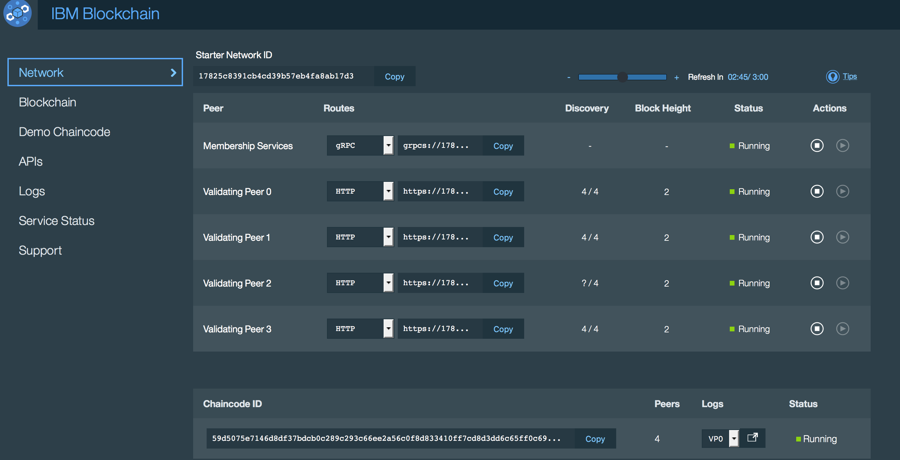
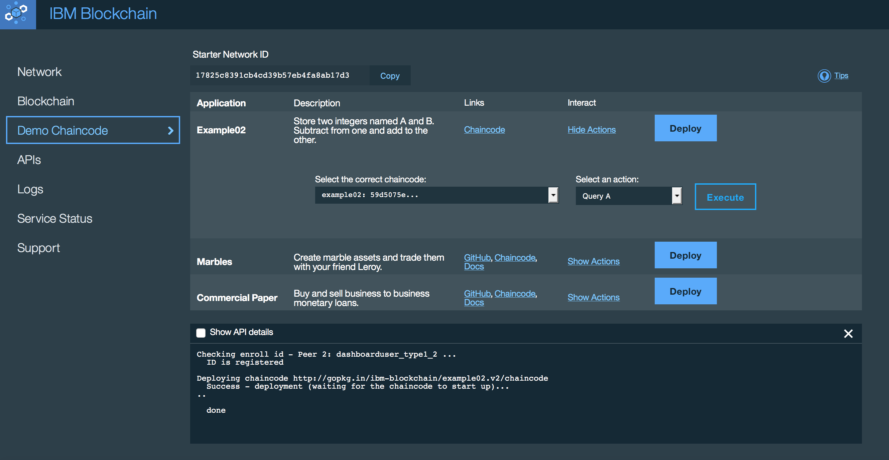
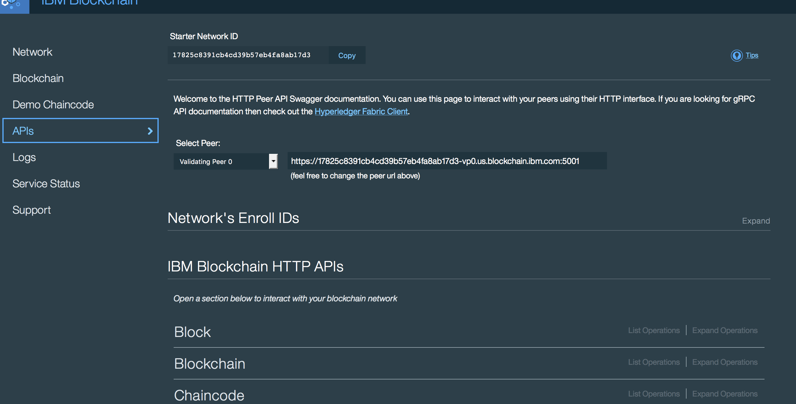
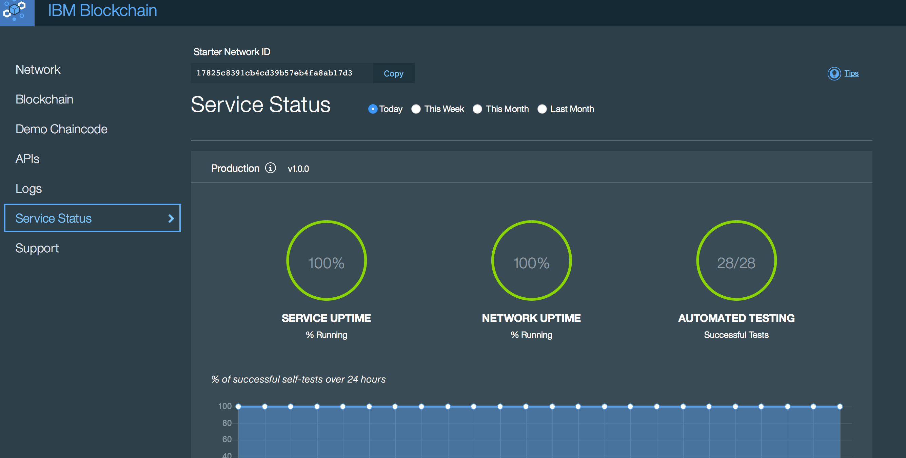
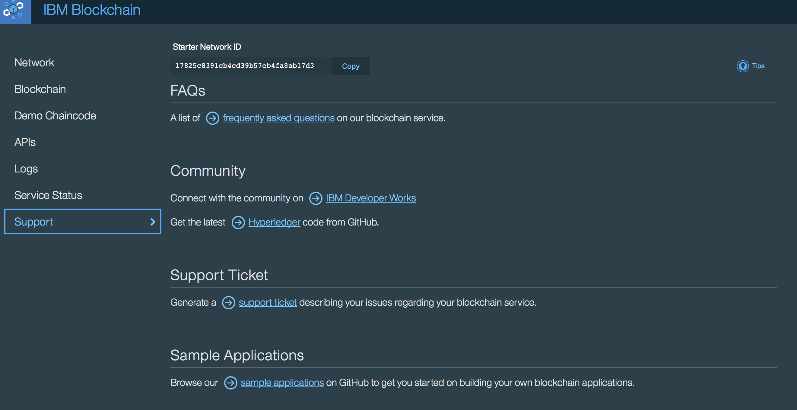

---

copyright:
  years: 2016
lastupdated: "2016-11-08"
---

{:new_window: target="_blank"}
{:shortdesc: .shortdesc}
{:codeblock: .codeblock}
{:screen: .screen}
{:pre: .pre}

# Dashboard-Überwachung
{: #blockchain_dashboard_monitor}

Die Dashboard-Überwachung vermittelt einen Überblick über die Blockchain-Umgebung, einschließlich Leistungsdaten und bereitgestelltem Chaincode. Mit der Überwachung können Sie Netzinformationen zu Peers, Protokollen, Hauptbuchstatus, APIs und Chaincode anzeigen.  
{:shortdesc}

In den folgenden Beispielen sehen Sie, dass auf den Registerkarten 'Überwachen' des Dashboards eindeutige Ansichten in Ihr Blockchain-Netz bereitgestellt werden:
  - Netz
  - Blockchain
  - Demo-Chaincode
  - APIs
  - Protokolle
  - Status
  - Support

**Registerkarte 'Netz'**: Überwachen Sie den Status der Peers und die aktiven Chaincode-Container (wie in Abbildung 1 dargestellt). Zeigen Sie die Discovery- und API-Routen für die validierenden Peers und die Zertifizierungsstelle an, die kombinierten Werte für Host und Port der Knoten. Der JSON-Code-Snippet für die **Serviceberechtigungsnachweise** in Bluemix für das **Service-Dashboard** gibt an, dass `"discovery_host"` und `"discovery_port"` mit der Route übereinstimmen, die in der Registerkarte **Netz** angezeigt werden. Diese Werte sind hilfreich, um manuell eine Verbindung zu Bluemix herzustellen.

*Abbildung 1. Registerkarte 'Netz'*

**Registerkarte 'Blockchain'**: Zeigen Sie den aktuellen Status von Blockchain an. Wie in Abbildung 2 dargestellt können Sie alle Transaktion, den aktuellen Status des Hauptbuchs und die Leistungsdaten für das Netz anzeigen:

*Abbildung 2. Registerkarte 'Blockchain'*

**Registerkarte 'Demo-Chaincode'**: Lernen Sie drei Chaincode-Beispielvorlagen kennen und experimentieren Sie mit ihnen; Sie können sie im Netz bereitstellen und aufrufen. Anweisungen für den Prozess werden bereitgestellt (siehe Abbildung 3). Alle Chaincode-Bereitstellungen und -Aufrufe werden ins Protokoll geschrieben und können auch in den Registerkarten 'Live-Protokolle', 'Blockchain' und 'API' angezeigt werden.  

*Abbildung 3. Registerkarte 'Demo-Chaincode'*

**Registerkarte 'APIs'**: Verwenden Sie die Swagger-Benutzerschnittstelle, um mit dem Blockchain-Netz über die REST-API wie in Abbildung 4 dargestellt zu interagieren:  

*Abbildung 4. Registerkarte 'APIs'*

**Registerkarte 'Protokolle'**: Zeigen Sie die Protokolle für die validierenden Peers und die Mitgliedschaftsservices an, in denen die Ergebnisse aller Transaktionen im Netz enthalten sind. Sie können Protokollinformationen zum Untersuchen von Transaktionen und zur Fehlerbehebung für Chaincode verwenden.  

*Abbildung 5. Registerkarte 'Protokolle'*

**Registerkarte 'Status'**: Zeigen Sie die Leistungsmessdaten für Service, Netz und automatische Tests wie in Abbildung 6 dargestellt an. Zeigen Sie die Daten für den vorherigen Monat an. Dieser Registerkarte enthält auch Codeankündigungen, allgemeine Foren, bekannte Probleme und Releaseinformationen für IBM Blockchain.  

*Abbildung 6. Registerkarte 'Status'*

**Registerkarte 'Support'**: Melden Sie ein Problem und zeigen Sie den Servicestatus wie in Abbildung 7 beschrieben an:

*Abbildung 7. Registerkarte 'Support'*
