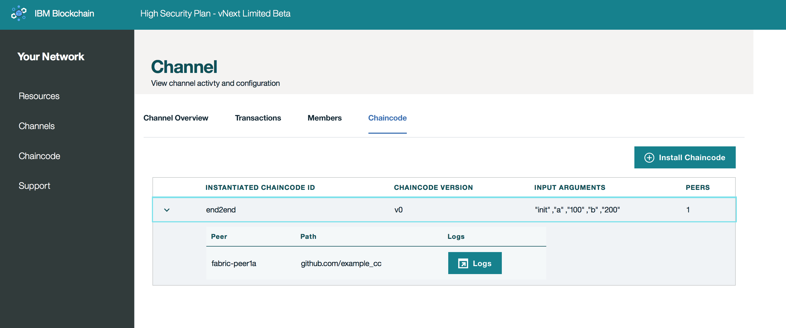

---

copyright:
  years: 2017

---

{:new_window: target="_blank"}
{:shortdesc: .shortdesc}
{:codeblock: .codeblock}
{:screen: .screen}
{:pre: .pre}

# Canaux
{: #v10_dashboard}
Dernière mise à jour : 16 mars 2017
{: .last-updated}

Les canaux offrent un mécanisme incroyablement puissant pour le partitionnement et l'isolement des données, et ils constituent la base essentielle
pour la confidentialité des données. Chaque réseau doit comporter au moins un canal pour que les transactions puissent s'effectuer.  
{:shortdesc}

Vous divisez votre réseau en canaux, où chaque canal représente un sous-ensemble de membres qui sont
autorisés à consulter les données des codes blockchain instanciés sur ce canal ; si vous n'êtes pas sur un canal, vous ne pouvez pas
voir les données. Chaque canal a un registre unique et les utilisateurs doivent être correctement authentifiés pour exécuter des opérations de lecture/écriture sur ces données. En outre, il est possible d'implémenter des listes de contrôle d'accès pour limiter l'accès de certains membres et utilisateurs (par exemple, pour limiter un membre aux opérations en lecture seule).

Imaginez un réseau comportant seulement six membres... Vous pourriez avoir un canal de type consortium où l'ensemble des six membres effectuent des transactions
et gèrent un registre pour un actif commun. Ces transactions et l'état des actifs impliqués seraient disponibles pour
tous les membres. Toutefois, pour certaines transactions bilatérales ou multilatérales qui nécessitent une confidentialité du réseau dans son ensemble,
vous pourriez créer des canaux distincts et ainsi masquer ces données.  

Il existe aussi des méthodes pour l'interaction de canal à canal dans le cas de scénarios métier plus complexes. Une application
peut être codée pour interroger la ou les valeurs d'une clé ou d'une clé composée sur le Canal A et utiliser les valeurs renvoyées pour un facteur
dans une transaction sur le Canal B. Pour plus d'informations sur les canaux, les stratégies et les transactions inter-canaux, consultez la [documentation Hyperledger Fabric](http://hyperledger-fabric.readthedocs.io/en/latest/arch-deep-dive.html).

La **Figure 2** illustre l'écran de tableau de bord initial qui affiche une présentation de tous les canaux de votre organisation Bluemix :

*Figure 2. Canaux*

Depuis cet écran, vous pouvez créer un canal, ou sélectionner un canal spécifique pour consulter des données plus précises sur le registre,
les codes blockchain et l'appartenance.  

La **Figure 3** illustre l'écran de *création d'un canal* :

*Figure 3. Création d'un canal*

Choisissez un nom qui reflète l'objectif métier du canal et inviter des membres du réseau en sélectionnant leur
**Nom de société** et en cliquant sur le bouton **Ajouter un membre**.  

La **Figure 4** illustre la présentation d'un canal spécifique. Elle affiche des informations de registre, comme la hauteur de bloc
et l'historique des transactions :

*Figure 4. Présentation des canaux*

La **Figure 5** illustre l'historique des transactions d'un canal spécifique. Elle affiche les horodatages pour chaque transaction et
l'ID de code blockchain correspondant à la transaction :

*Figure 5. Transactions de canal*

La **Figure 6** illustre le registre d'appartenance d'un canal spécifique. Il affiche les noms de société et l'e-mail correspondant
d'un administrateur système :

*Figure 6. Membre d'un canal*

La **Figure 7** illustre le registre de code blockchain d'un canal spécifique. Elle affiche des informations uniques sur chaque code blockchain, comme
l'ID de code blockchain, la version, les arguments d'instanciation et les homologues :  

*Figure 7. Code blockchain de canal*

La valeur **PEERS** représente simplement le nombre d'homologues sur le canal dont le conteneur de code blockchain est en cours d'exécution. Consultez la
section **Code blockchain** ci-dessous pour plus d'informations sur l'instanciation.  
