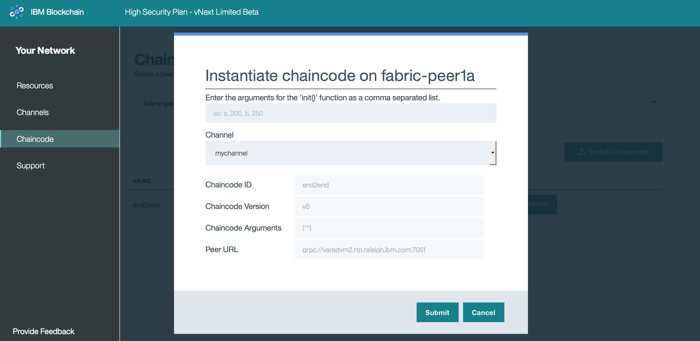

---

copyright:
  years: 2017

---

{:new_window: target="_blank"}
{:shortdesc: .shortdesc}
{:codeblock: .codeblock}
{:screen: .screen}
{:pre: .pre}

# Chaincode
{: #v10_dashboard}
Ultimo aggiornamento: 16 marzo 2017
{: .last-updated}

Chaincode è un software (attualmente scritto in Go o Java) che incapsula la logica di business e le istruzioni transazionali
per la creazione e la modifica delle risorse.  Viene eseguito in un contenitore docker associato a un qualsiasi peer che deve interagire con esso.  
{:shortdesc}

Chaincode viene prima installato sul filesystem di un peer e quindi ne viene creata un'istanza su un canale.  Il passo di creazione dell'istanza implica
l'inizializzazione di coppie chiave/valore e la distribuzione del contenitore chaincode.  Qualsiasi peer che voglia interagire con un
chaincode deve avere un codice sorgente installato sul suo filesystem e un contenitore chaincode in esecuzione.  Tuttavia, se un peer
vuole utilizzare la stessa applicazione chaincode su più canali, avrà bisogno di una sola istanza del contenitore.  

La **Figura 8** mostra la panoramica di installazione del chaincode:

*Figura 8. Panoramica di installazione del chaincode*

* Utilizza il menu a discesa e seleziona un peer su cui installare il chaincode.   
* Fai clic sul pulsante **Installa chaincode** sul lato destro dello schermo; si aprirà un nuovo pannello.

La **Figura 9** mostra la finestra di installazione del chaincode:

*Figura 9. Finestra di installazione del chaincode*

* Compila i campi relativi a ID chaincode e Versione chaincode.  Tieni conto degli schemi di denominazione in quanto queste stringhe verranno utilizzate nelle applicazioni client per interagire con determinati chaincode.
* Fai clic sul pulsante Sfoglia e accedi attraverso il tuo filesystem locale alla posizione in cui è memorizzato il tuo codice di origine chaincode. Seleziona uno o più file da installare sul tuo peer.  **Nota**: si consiglia di caricare solo il chaincode scritto in Go o Java.  

Una volta che un chaincode è stato installato sul filesystem di un peer, è necessario crearne un'istanza su un canale.  Il passo di creazione dell'istanza richiama la funzione `init` per eseguire qualsiasi inizializzazione necessaria del chaincode.  Spesso ciò implicherà l'impostazione di coppie chiave/valore che compongono lo stato globale iniziale di un chaincode. 

La **Figura 10** mostra la finestra di creazione di un'istanza del chaincode: 

*Figura 10. Finestra di creazione di un'istanza del chaincode*

Nota che le coppie chiave/valore vengono impostate con la stringa - `["a","b","200","250"]` - e che c'è una finestra per selezionare il canale su cui creare l'istanza.  Questo esempio mostra un chaincode denominato `end2end` installato su `fabric-peer1a` e con l'istanza creata sul canale denominato `mychannel`:

La combinazione di installazione/creazione istanza è una funzione potente in quanto consente a un peer di interagire con lo stesso contenitore chaincode tra più canali. L'unico prerequisito è che l'origine reale del chaincode sia installata sul filesystem del peer.  In questo modo, se una parte di chaincode comune viene utilizzata in dozzine di canali, un peer avrà bisogno solo di un unico contenitore per eseguire operazioni di lettura/scrittura su tutti i registri di canale.   Questo semplice approccio si rivela vantaggioso in termini di produttività e prestazioni di calcolo man mano che le applicazioni chaincode e di scala di reti diventano più elaborate.    
