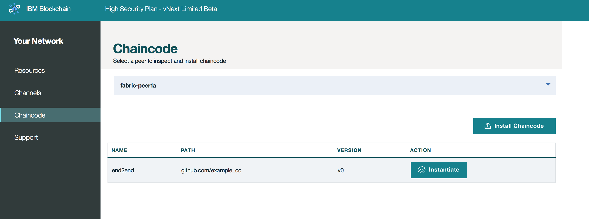

---

copyright:
  years: 2017

---

{:new_window: target="_blank"}
{:shortdesc: .shortdesc}
{:codeblock: .codeblock}
{:screen: .screen}
{:pre: .pre}

# チェーンコード
{: #v10_dashboard}
最終更新日: 2017 年 3 月 16 日
{: .last-updated}

チェーンコードは、資産を作成および変更するためのビジネス・ロジックおよびトランザクション命令をカプセル化したソフトウェア (現在は Go または Java で作成されている) です。チェーンコードと対話する必要のある任意のピアに関連付けられた Docker コンテナーで実行されます。  
{:shortdesc}

チェーンコードは、まずピアのファイル・システムにインストールされてから、チャネルでインスタンス化されます。インスタンス化のステップには、キー値ペアの初期化とチェーンコード・コンテナーのデプロイメントが含まれます。チェーンコードと対話しようとするピアでは、ファイル・システムにソース・コードがインストールされ、チェーンコード・コンテナーが稼働していなければなりません。ただし、ピアが複数のチャネルで同じチェーンコード・アプリケーションを使用しようとする場合も、コンテナーのインスタンスは 1 つのみでかまいません。  

**図 8** に、チェーンコードのインストールの概要を示します。

*図 8. チェーンコードのインストールの概要*

* ドロップダウン・メニューを使用し、チェーンコードのインストール先のピアを選択します。  
* 画面の右側の**「チェーンコードのインストール (Install Chaincode)」**ボタンをクリックします。これにより新しいパネルが開きます。

**図 9** に、チェーンコードのインストール・ウィンドウを示します。

*図 9. チェーンコードのインストール・ウィンドウ*

* チェーンコード ID およびチェーンコード・バージョンのフィールドに値を入力します。命名方式を認識しておいてください。特定のチェーンコードと対話するためにクライアント・アプリでそれらのストリングが使用されるためです。
* 参照ボタンをクリックし、ローカル・ファイル・システムで、チェーンコードのソースが格納されている場所にナビゲートします。ピアにインストールするファイルを 1 つ以上選択します。**注**: Go または Java で作成されたチェーンコードのみをアップロードすることをお勧めします。  

ピアのファイル・システムにチェーンコードがインストールされたら、次にそれをチャネルでインスタンス化する必要があります。このインスタンス化ステップは、`init` 関数を呼び出して、必要なチェーンコード初期化を実行します。多くの場合、これにはチェーンコードの初期ワールド・ステートを構成するキー値ペアの設定が含まれます。

**図 10** に、チェーンコードのインスタンス化ウィンドウを示します。 

*図 10. チェーンコードのインスタンス化ウィンドウ*

キー値ペアが `["a","b","200","250"]` というストリングと共に設定されていること、およびインスタンス化を行うチャネルを選択するウィンドウがあることに注意してください。この例では、`fabric-peer1a` にインストールされ、`mychannel` という名前のチャネルでインスタンス化された`end2end` という名前のチェーンコードを示しています。

インストール/インスタンス化の組み合わせは強力な機能です。これにより、ピアが複数のチャネルにわたって同じチェーンコード・コンテナーと対話できるようになるためです。唯一の前提条件は、ピアのファイル・システムに実際のチェーンコードのソースがインストールされることです。そのため、共通のチェーンコードの断片が数十個のチャネルにわたって使用されている場合でも、ピアがすべてのチャネル台帳で読み取り/書き込みを実行するために必要なチェーンコード・コンテナーの数は 1 つのみです。ネットワークが拡大し、チェーンコード・アプリケーションがより複雑化しているため、この軽量なアプローチが計算のパフォーマンスおよびスループットの面で有益であることが分かっています。    
