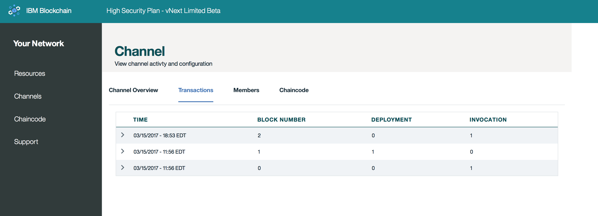
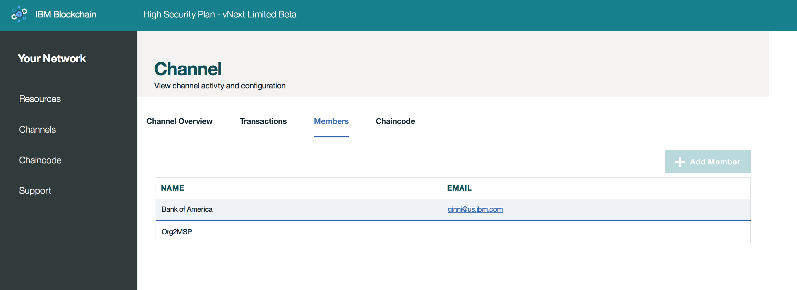

---

copyright:
  years: 2017

---

{:new_window: target="_blank"}
{:shortdesc: .shortdesc}
{:codeblock: .codeblock}
{:screen: .screen}
{:pre: .pre}

# 채널
{: #v10_dashboard}
마지막 업데이트 날짜: 2017년 3월 16일
{: .last-updated}

채널은 데이터의 파티션을 지정하고 분리하는 믿을 수 없을 정도로 강력한 메커니즘이며 데이터 개인정보 보호정책에 대한
기반을 제공합니다. 모든 네트워크에는 최소한 하나 이상의 채널이 있어야 트랜잭션이 발생할 수 있습니다.   
{:shortdesc}

네트워크를 채널로 분리하고 여기에서 각 채널은 해당 채널에서 인스턴스화된 체인코드에 대한 데이터를 볼 수 있는
멤버의 서브세트를 표시합니다. 채널에 있지 않은 경우 데이터를 볼 수 없습니다. 각 채널에는 고유 원장이 있으며
이 데이터에 대해 읽기/쓰기 오퍼레이션을 수행하려면 사용자가 올바르게 인증되어야 합니다. 또한 특정 멤버 및 사용자를
제한하기 위해(예: A 멤버는 읽기 전용으로 제한됨) 액세스 제어 목록을 구현할 수 있습니다. 

6명의 멤버가 있는 네트워크를 사용한다고 상상해 보십시오. 6명의 모든 멤버가 트랜잭션을 수행하고 공통 자산에 대한
원장을 유지보수하는 컨소시엄 유형의 채널이 있을 수 있습니다. 이러한 트랜잭션과 관련된 자산의 상태는 모든 멤버가 사용할
수 있습니다. 그러나 일반적으로 네트워크에서 개인정보 보호정책이 필요한 특정 쌍방 또는 다자간 트랜잭션의 경우 별도의
채널을 작성할 수 있고 이를 통해 이 데이터를 숨길 수 있습니다.   

보다 복잡한 비즈니스 시나리오의 경우 채널이 상호작용을 전송하는 방법도 있습니다. 채널 A의 키 값 또는 복합 키를
조회하도록 애플리케이션을 코딩할 수 있으며 그런 다음 리턴된 값을 사용하여 채널 B의 트랜잭션을 요소로 포함시킬 수 있습니다.
채널, 정책 및 교차 채널 트랜잭션에 대한 자세한 정보는 [Hyperledger
Fabric 문서](http://hyperledger-fabric.readthedocs.io/en/latest/arch-deep-dive.html)를 참조하십시오. 

**그림 2**는 Bluemix 조직에 대한 모든 채널 개요를 표시하는 초기 대시보드 화면을 보여줍니다. 

*그림 2. 채널*

이 화면에서 채널을 작성하거나 원장, 체인코드 및 멤버십에 대한 세부사항을 추가로 표시할 특정
채널을 선택할 수 있습니다.   

**그림 3**은 *채널 작성* 화면을 표시합니다. 

*그림 3. 채널 작성*

채널의 비즈니스 목표를 반영하는 이름을 선택하고 **회사 이름**을 선택한 후 **멤버 추가** 단추를 클릭하여
네트워크 멤버 조합을 초대하십시오.   

**그림 4**는 특정 채널의 개요를 표시합니다. 블록 높이 및 트랜잭션 히스토리와 같은 원장 정보를 표시합니다. 

*그림 4. 채널 개요*

**그림 5**는 특정 채널의 트랜잭션 히스토리를 표시합니다. 각 트랜잭션에 대한 시간소인 및 트랜잭션의 해당 체인코드 ID를 표시합니다. 

*그림 5. 채널 트랜잭션*

**그림 6**은 특정 채널의 멤버십 레지스트리를 표시합니다. 회사 이름 및 시스템 관리자의 해당 이메일을 표시합니다.

*그림 6. 채널 멤버*

**그림 7**은 특정 채널의 체인코드 레지스트리를 표시합니다. 각 체인코드에 대한 고유 정보(예: 체인코드 ID, 버전, 인스턴스화 인수 및 피어)를 표시합니다.   

*그림 7. 채널 체인코드*

**피어** 값은 단순히 체인코드 컨테이너가 실행 중인 채널의 피어 숫자입니다. 인스턴스화에 대한 자세한 정보는
아래의 **체인코드** 섹션을 참조하십시오.   
