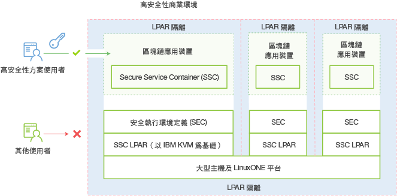

---

copyright:
  years: 2017
lastupdated: "2017-03-15"
---

{:new_window: target="_blank"}
{:shortdesc: .shortdesc}
{:codeblock: .codeblock}
{:screen: .screen}
{:pre: .pre}

# IBM Secure Service Container
{: #etn_ssc}

**HSBN vNext 測試版**方案及 HSBN 方案是以應用裝置形式部署至 IBM Secure Service Container，後者提供用來管理區塊鏈服務的基本基礎架構。應用裝置會結合作業系統、Docker 容器、中介軟體，以及獨立運作的軟體元件，並且提供具有最佳化安全的核心服務和基礎架構。
{:shortdesc}

下列架構圖說明 IBM Secure Service Container 及區塊鏈應用裝置的組織方式：

*圖 1. IBM Secure Service Container 及區塊鏈應用裝置的概觀*

IBM Secure Service Container 為區塊鏈服務帶來 z Systems LinuxONE 平台的進階加密法、安全及可靠性，可以處理機密資料和受法規管理的資料。區塊鏈是透過 IBM Secure Service Container 的一系列特性進行保護：封裝的作業系統、加密的應用裝置磁碟、竄改保護、受保護的記憶體，以及可配置成符合 EAL5+ 憑證的強 LPAR 隔離。

## 主要安全特性
IBM Secure Service Container 提供區塊鏈服務的下列最佳化安全功能：  

### 保護資料免受系統管理者存取
>即使是平台或系統管理者也無法存取應用裝置程式碼。資料存取是透過應用裝置進行控制，因此，已停用未獲授權的存取。這是透過結合簽署與加密所有進行中及靜止資料來支援。也會一併移除對記憶體的所有存取。韌體透過安全啟動架構予以支援。

>由 IBM Secure Service Container 保護區塊鏈安全時，系統管理者具有下列限制：
>* 無法存取節點
>* 無法檢視區塊鏈網路

### 竄改保護  
>IBM Secure Service Container 會停用所有提供 LPAR 記憶體存取的外部介面。已簽署映像檔啟動載入器，確保它無法被竄改，也無法交換成不同的映像檔啟動載入器。

### 加密的應用裝置磁碟
>磁碟上儲存的所有程式碼及資料，會使用 Linux 加密層隨時加密：  
- 封裝的作業系統
- 受保護的 IP
- 內嵌的監視及自我修復  
