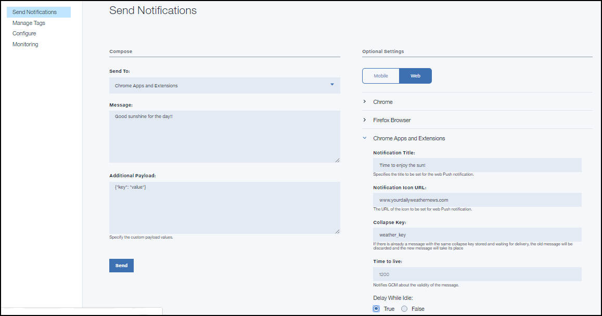

---

copyright:
 years: 2015, 2017

---

{:new_window: target="_blank"}
{:shortdesc: .shortdesc}
{:screen:.screen}
{:codeblock:.codeblock}

# Sending basic notifications to Chrome Apps and Extensions 
{: #web_extensions_notifications}
Last updated: 11 January 2017
{: .last-updated}

After you have developed your applications, you can send a push notification. 

1. Select **Send Notifications**, and compose a message by choosing **Web Notifications** as the **Send To** option. 
2. Type the message that needs to be delivered in the **Message** field.
3. You can choose to provide optional settings:
  - **Notification Title**: This is the text that would be displayed as message alert heading.
  - **Notification Icon URL**: If your message needs to be delivered with an app notification icon, provide the link to your icon in the field.
  - **Collapse key**: Collapse keys are attached to notifications. If multiple notifications arrive sequentially with the same collapse key when the device is offline, they are collapsed. When a device comes online, it receives notifications from the FCM/GCM server, and displays only the latest notification bearing the same collapse key. If the collapse key is not set, both the new and old messages are stored for the future delivery.
  - **Time to live**: This value is set in seconds. If this parameter is not specified, the FCM/GCM server stores the message for four weeks and will try to deliver. The validity expires after four weeks. The possible value range is from 0 to 2,419,200 seconds.
  - **Delay when idle**: Setting this value to `true` instructs the FCM/GCM server not to deliver the notification if the device is idle. Set this value to `false`, to ensure delivery of notification even if the device is idle.
  - **Additional payload**: Specifies the custom payload values for your notifications.

The following image shows the Chrome Apps and Extensions notifications option in the dashboard.

  
  
## Next steps
  {: #next_steps_tags}

After you have successfully set up basic notifications, you can choose to configure tag-based notifications and advanced options.

Add these {{site.data.keyword.mobilepushshort}} service features to your app. To use tag-based notifications, see [Tag-based Notifications](c_tag_basednotifications.html). To use advanced notifications options, see [Advanced notifications](t_advance_badge_sound_payload.html).
