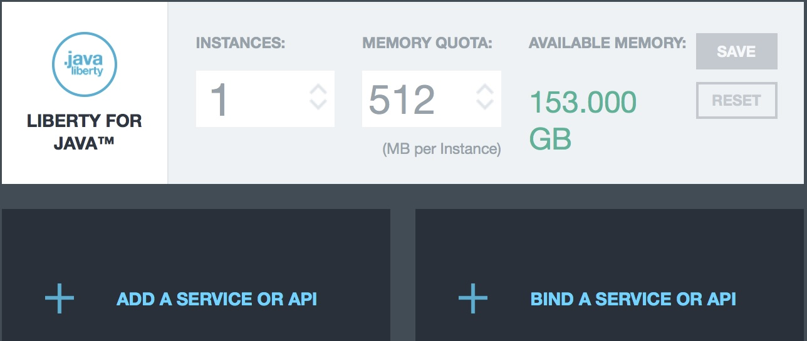

---

copyright:
 years: 2015, 2017

---

{:new_window: target="_blank"}
{:shortdesc: .shortdesc}
{:screen:.screen}
{:codeblock:.codeblock}

# Création d'un service {{site.data.keyword.mobilepushshort}} non lié pour Android
{: #create_android_unbound}
Dernière mise à jour : 11 janvier 2017
{: .last-updated}

Créez une instance de service {{site.data.keyword.mobilepushshort}}. Vous pouvez utiliser l'instance de service {{site.data.keyword.mobilepushshort}} sans liaison à aucune application de back end.

1. Liez l'instance de service {{site.data.keyword.mobilepushshort}} à une application Bluemix. Lors de cette opération, vous serez en mesure de voir tous les détails en rapport avec le service, qui sont stockés au format JSON dans la variable d'environnement VCAP_SERVICES. 


 2. Cliquez sur le bouton de liaison et choisissez l'instance de service {{site.data.keyword.mobilepushshort}} à lier. Quand votre application est liée au service {{site.data.keyword.mobilepushshort}}, les informations sur le service sont stockées au format JSON dans la variable d'environnement VCAP_SERVICES de votre application. par exemple : 
```
 	{
    "imfpush_Dev": [
   {
         "name": "myname_sampleUnbound",
         "label": "imfpush_Dev",
         "plan": "Basic",
         "credentials": null
      }
    ]
    }
```
	{: codeblock}
