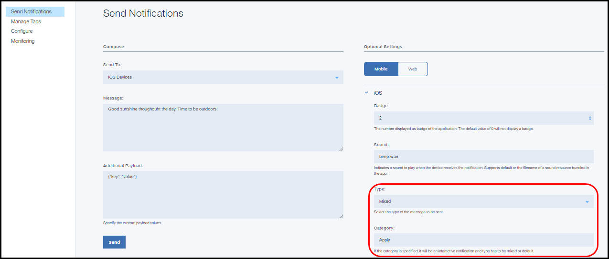

---

copyright:
years: 2015, 2017

---

{:new_window: target="_blank"}
{:shortdesc: .shortdesc}
{:screen:.screen}
{:codeblock:.codeblock}

#啟用 iOS 應用程式來傳送 {{site.data.keyword.mobilepushshort}}
{: #enable-push-ios-notifications}
前次更新：2017 年 2 月 14 日
{: .last-updated}

您可讓 iOS 應用程式傳送 {{site.data.keyword.mobilepushshort}} 至您的裝置。


##安裝 CocoaPods
{: #enable-push-ios-notifications-install}

針對現有的 Xcode 專案，您可以使用 CocoaPods 相依關係管理工具來設定 Bluemix Mobile Services Client SDK。替代方案是手動安裝 SDK。

若要檢視 Swift Push Readme 檔，請移至 [Readme ](https://github.com/ibm-bluemix-mobile-services/bms-clientsdk-swift-push/tree/master){: new_window}。


1. 在 Mac 終端機中，使用下列指令來安裝 CocoaPods。
```$ sudo gem install cocoapods
```
	{: codeblock}
2. 在終端機中輸入 `pod init` 指令，以起始設定 CocoaPods。請確定您從 Xcode 專案所在的目錄執行指令。`pod init` 指令會建立 Podfile。  
3. 在產生的 Podfile 中，新增必要 SDK 相依關係。請複製下列 Podfile。
   
	```
		source 'https://github.com/CocoaPods/Specs.git'
	// Copy the following list as is and remove the dependencies you do not need.
	use_frameworks!
	target 'MyApp' do
	    platform :ios, '8.0'
	    pod 'BMSCore'
	    pod 'BMSPush'
      pod 'BMSAnalyticsAPI'
	end
	```
		{: codeblock}

3. 從終端機中，移至您的專案資料夾，並使用 `pod update` 指令來安裝相依關係。

此指令會安裝相依關係並建立新的 Xcode 工作區。  
**附註**：請確定您一律開啟新的 Xcode 工作區，而不是原始 Xcode 專案檔：
```
$ open App.xcworkspace
```
	{: codeblock}

工作區會包含原始專案以及包含相依關係的 Pods 專案。若要修改 Bluemix Mobile Services 來源資料夾，您可以在 Pods 專案的 `Pods/yourImportedSourceFolder` 下找到它，例如：`Pods/BMSPush`。

##使用 Carthage 新增架構
{: #carthage}

使用 [Carthage ](https://github.com/Carthage/Carthage#if-youre-building-for-ios-tvos-or-watchos){: new_window}，將架構新增至您的專案。請注意，不支援 Xcode8 形式的 Carthage。

1. 在 Cartfile 中新增 `BMSPush` 架構：
```
github "github "ibm-bluemix-mobile-services/bms-clientsdk-swift-push" ~> 1.0"
```
	{: codeblock}
2. 執行 `carthage update` 指令。建置完成時，請將 `BMSPush.framework`、`BMSCore.framework` 及 `BMSAnalyticsAPI.framework` 拖曳至 Xcode 專案。
3. 遵循在 [Carthage ](https://github.com/Carthage/Carthage#if-youre-building-for-ios-tvos-or-watchos){: new_window} 網站的指示，以完成整合。

##設定 iOS SDK
{: ios-sdk}

設定 iOS SDK，並新增下列程式碼至應用程式中的 **AppDelegate.swift** 檔案。請注意，這也會使用 APNs 登錄。  
```
func application(_ application: UIApplication,
didFinishLaunchingWithOptions launchOptions: [NSObject: AnyObject]?) -> Bool
 {
 BMSPushClient.sharedInstance.initializeWithAppGUID(appGUID: "APP-GUID-HERE", clientSecret:"CLIENT-SECRET-HERE")
  }
```
    {: codeblock}

##使用匯入的架構和來源資料夾
{: using-imported-frameworks}

在您的程式碼中參照 SDK。請確定已具備下列必備項目。

- iOS 8.0 或以上版本	
- Xcode 7

撰寫相關標頭的 `#import` 指引，例如：
```
//swift
import BMSCore
import BMSPush
```
		{: codeblock}

若要閱讀 Swift Push Readme 檔案，請參閱 [Readme ](https://github.com/ibm-bluemix-mobile-services/bms-clientsdk-swift-push/tree/master){: new_window}。

**附註**：使用 CocoaPods 指令 `pod install` 或 `pod update` 更新 Pods 專案時，可能會置換 Bluemix Mobile Services 來源資料夾。如果您要保留原始檔案的自訂版本，請確保先進行備份，然後再發出下列其中一個指令。


##建置設定
{: build-settings}

移至 **Xcode > 建置設定 > 建置選項，然後將啟用位元碼**設為**否**。

**注意**：自 iOS 9 開始，對「應用程式傳輸安全 (ATS)」特性進行的變更可能會影響您處理鑑別處理程序的方式。下列部落格文章說明這些變更的相關資訊：[ATS and Bitcode in iOS 9 ](https://developer.ibm.com/mobilefirstplatform/2015/09/09/ats-and-bitcode-in-ios9/){: new_window} and [Connect your iOS 9 app to Bluemix today ](https://developer.ibm.com/bluemix/2015/09/16/connect-your-ios-9-app-to-bluemix/){: new_window}。

## 起始設定 Push SDK for iOS 應用程式
{: #enable-push-ios-notifications-initialize}

放置起始設定碼的一般位置位於 iOS 應用程式的應用程式委派中。按一下「Push 儀表板」中的**行動選項**鏈結，以取得應用程式路徑及 GUID。

###起始設定 Core SDK
{: Initializing-the-core-sdk}


```
// Initialize the Core SDK for Swift with IBM Bluemix GUID, route, and region
let myBMSClient = BMSClient.sharedInstance
myBMSClient.initialize(bluemixRegion: "Location where your app is hosted.")
```
	{: codeblock}

### 路徑、GUID 及 Bluemix 地區
{: route-guid-bluemix-region}

####appRoute
{: ios-approute}

指定指派給您在 Bluemix 上所建立之伺服器應用程式的路徑。

####GUID
{: ios-guid}

指定指派給您在 Bluemix 上所建立之應用程式的唯一索引鍵。此值區分大小寫。

####bluemixRegionSuffix
{: ios-bluemixRegionSuffix}

指定管理應用程式的位置。`bluemixRegion` 參數指定您所使用的 Bluemix 部署。您可以使用 `BMSClient.REGION` 靜態內容設定此值，然後使用下列三個值的其中一個：

- BMSClient.Region.usSouth 
- BMSClient.Region.unitedKingdom
- BMSClient.Region.sydney

####AppGUID
{: ios-AppGUID}

指定指派給您在 Bluemix 上所建立之 {{site.data.keyword.mobilepushshort}} Service 的唯一 AppGUID 索引鍵。

###起始設定 Client Push SDK
{: initializing-the-client-Push-SDK}

```
	//Initialize client Push SDK for Swift
let push = BMSPushClient.sharedInstance
push.initializeWithAppGUID("appGUID", clientSecret:"clientSecret")
```
	{: codeblock}


## 登錄 iOS 應用程式及裝置
{: #enable-push-ios-notifications-register}


在裝置上安裝應用程式之後，應用程式必須向 APNs 登錄才能接收遠端通知。在應用程式接收到 APNs 所產生的裝置記號之後，必須將裝置記號傳回給 {{site.data.keyword.mobilepushshort}} Service。

若要登錄 iOS 應用程式及裝置，您需要：

1. 建立後端應用程式。
2. 將記號傳遞至 {{site.data.keyword.mobilepushshort}}。


###建立後端應用程式
{: create-a-backend-app}

在 Bluemix® 型錄的「樣板」區段中建立後端應用程式，以自動將 {{site.data.keyword.mobilepushshort}} Service 連結至此應用程式。如果您已建立後端應用程式，請確定將應用程式連結至 {{site.data.keyword.mobilepushshort}} Service。


###將記號傳遞至 {{site.data.keyword.mobilepushshort}}
{: pass-token-push-notifications}

從 APNs 接收到記號之後，將記號傳遞至 {{site.data.keyword.mobilepushshort}}，這是 `registerWithDeviceToken` 方法的一部分。

從 APNs 接收到記號之後，將記號傳遞至 Push Notifications，這是 `didRegisterForRemoteNotificationsWithDeviceToken` 方法的一部分。

```
func application (_application: UIApplication, didRegisterForRemoteNotificationsWithDeviceToken deviceToken: Data){
   let push =  BMSPushClient.sharedInstance
   push.registerWithDeviceToken(deviceToken) { (response, statusCode, error) -> Void in
      if error.isEmpty {
           print( "Response during device registration : \(response)")
            print( "status code during device registration : \(statusCode)")
       }
        else{
            print( "Error during device registration \(error) ")
            print( "Error during device registration \n  - status code: \(statusCode) \n Error :\(error) \n")
        }
    }
  }
```
	{: codeblock}


## 在 iOS 裝置上接收推送通知
{: #enable-push-ios-notifications-receiving}


若要在 iOS 裝置上接收推送通知，請將下列 Swift 方法新增至應用程式的應用程式委派。

```
// For Swift
func application(_ application: UIApplication, didReceiveRemoteNotification userInfo: [AnyHashable : Any], fetchCompletionHandler completionHandler: @escaping (UIBackgroundFetchResult) -> Void) 
{ //UserInfo dictionary will contain data sent from the server }
```
	{: codeblock}

## 監視 iOS 裝置上的推送通知
{: ios-monitoring}

若要監視通知的現行狀態，請將下列 Swift 方法新增至應用程式的應用程式委派。

```
	// Send notification status when app is opened by clicking the notifications
func application(_ application: UIApplication, didReceiveRemoteNotification userInfo: [AnyHashable : Any]) {
 let push =  BMSPushClient.sharedInstance
 let respJson = (userInfo as NSDictionary).value(forKey: "payload") as! String
 let data = respJson.data(using: String.Encoding.utf8)
 let jsonResponse:NSDictionary = try! JSONSerialization.jsonObject(with: data! , options: JSONSerialization.ReadingOptions.allowFragments) as! NSDictionary
 let messageId:String = jsonResponse.value(forKey: "nid") as! String
    push.sendMessageDeliveryStatus(messageId: messageId) { (res, ss, ee) in
      print("Send message status to the Push server")
     }
}
```
	{: codeblock}

```
	// Send notification status when the app is in background mode.
func application(_ application: UIApplication, didReceiveRemoteNotification userInfo: [AnyHashable : Any], fetchCompletionHandler completionHandler: @escaping (UIBackgroundFetchResult) -> Void) {
 let payLoad = ((((userInfo as NSDictionary).value(forKey: "aps") as! NSDictionary).value(forKey: "alert") as! NSDictionary).value(forKey: "body") as! NSString)
 self.showAlert(title: "Recieved Push notifications", message: payLoad)
 let push =  BMSPushClient.sharedInstance
 let respJson = (userInfo as NSDictionary).value(forKey: "payload") as! String
 let data = respJson.data(using: String.Encoding.utf8)
 let jsonResponse:NSDictionary = try! JSONSerialization.jsonObject(with: data! , options: JSONSerialization.ReadingOptions.allowFragments) as! NSDictionary
 let messageId:String = jsonResponse.value(forKey: "nid") as! String
 push.sendMessageDeliveryStatus(messageId: messageId) { (res, ss, ee) in
       completionHandler(UIBackgroundFetchResult.newData)
   }
}
```
	{: codeblock}


## 傳送基本推送通知
{: #send}

開發應用程式之後，您可以傳送基本推送通知。

若要傳送基本推送通知，請完成下列步驟：

1. 選取**傳送通知**，然後選擇**傳送至**選項來編寫訊息。支援的選項是**依標籤的裝置**、**裝置 ID**、**使用者 ID**、**Android 裝置**、**iOS 裝置**、**Web 通知**及**所有裝置**。  
**附註**：當您選取**所有裝置**選項時，所有已訂閱 {{site.data.keyword.mobilepushshort}} 的裝置都會接收到通知。

2. 在**訊息**欄位中，編寫訊息。視需要選擇配置選用設定。
3. 按一下**傳送**。
3. 驗證您的裝置已接收到通知。

下列影像顯示處理 {{site.data.keyword.mobilepushshort}} iOS 裝置的警示框。

 

### 傳送通知的選用設定
{: #send_ios_otpional_setting}

您可以進一步自訂 {{site.data.keyword.mobilepushshort}} 設定，以將通知傳送給 iOS 裝置。支援下列選用自訂選項。


- **徽章**：指出應用程式徽章上所顯示的號碼。預設值是零 (0)，而且這不會顯示徽章。 
- **音效**：指出要在收到通知時播放的音效短片。支援預設值或應用程式中所組合的音效資源名稱。
- **其他有效負載**：指定通知的自訂有效負載值。

##啟用互動式通知

現在，您可以使用更多詳細資料強化您的 iOS 通知，例如透過啟用互動式通知來新增影像、地圖或回應按鈕。這樣可提供更多環境定義給客戶，並且能夠立即採取動作而不需要離開現行環境定義。  

若要啟用互動式通知，請使用下列程式碼：

```
	// This defines the button action.
let actionOne = BMSPushNotificationAction(identifierName: "ACCEPT", buttonTitle: "Accept", isAuthenticationRequired: false, defineActivationMode: UIUserNotificationActivationMode.background)
 let actionTwo = BMSPushNotificationAction(identifierName: "DECLINE", buttonTitle: "Decline", isAuthenticationRequired: false, defineActivationMode: UIUserNotificationActivationMode.background)
```
	{: codeblock}
```
	// This defines category for the buttons
let category = BMSPushNotificationActionCategory(identifierName: "category", buttonActions: [actionOne, actionTwo])
```
	{: codeblock}
```
	// This updates the registration to include the buttonsPass the defined category into iOS BMSPushClientOptions
let notificationOptions = BMSPushClientOptions(categoryName: [category])
let push = BMSPushClient.sharedInstance
push.initializeWithAppGUID(appGUID: "APP-GUID-HERE", clientSecret:"CLIENT-SECRET-HERE", options: notificationOptions)
```
	{: codeblock}

若要傳送互動式通知，請完成下列步驟：

1. 在「組合」區段的「傳送至」下拉清單，選取 **iOS 裝置**。
2. 輸入您可能想要傳送的通知訊息。
3. 在「選用性設定」區段中，選取**行動**然後按一下 **iOS**。
4. 在「類型」下拉清單中，選取**混合**。
5. 在「種類」欄位中，指定您已在應用程式定義的通知類型。 

 

## 後續步驟
{: #next_steps_tags}

順利設定基本通知之後，您就可以配置標籤型通知及進階選項。

將這些 Push Notifications Service 特性新增至您的應用程式。
若要使用標籤型通知，請參閱[標籤型通知](c_tag_basednotifications.html)。
若要使用進階通知選項，請參閱[啟用進階推送通知](t_advance_badge_sound_payload.html)。
