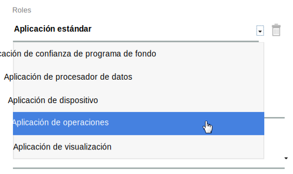
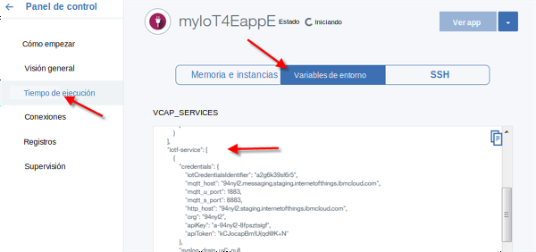

---

copyright:
  years: 2016, 2017
lastupdated: "2017-03-10"
---

<!-- Common attributes used in the template are defined as follows: -->
{:new_window: target="blank"}
{:shortdesc: .shortdesc}
{:screen: .screen}
{:codeblock: .codeblock}
{:pre: .pre}

# Gestión de los datos y dispositivos
{: #iot4e_dashboard}
Visualice los datos de los dispositivos registrados y gestione sus dispositivos y usuarios en {{site.data.keyword.iot_full}} con el panel de control de {{site.data.keyword.iotelectronics}}.
{:shortdesc}

Utilice el panel de control de {{site.data.keyword.iotelectronics}} para
- Ver dispositivos registrados en su organización
- Correlacionar usuarios con dispositivos
- Realizar acciones masivas como añadir y suprimir grandes cantidades de dispositivos
- Extraer datos de dispositivos

## Apertura del panel de control
{: #iot4e_opendashboard}

**Importante:** Antes de poder utilizar el panel de control por primera vez, debe [habilitarlo](#iot4e_enabledashboard).

Para abrir el panel de control
1. Abra el panel de control de {{site.data.keyword.Bluemix_notm}} y pulse el nombre del servicio {{site.data.keyword.iot_short_notm}}.  

    **Consejo:** El nombre de servicio termina en `iotf-service` y se describe como *Plataforma Internet de las cosas* en la columna Oferta de servicios.
2. En la página de bienvenida, pulse **Iniciar**.
3. En el menú, seleccione **Electronics**.

## Habilitación del panel de control
{: #iot4e_enabledashboard}

Para habilitar el panel de control de {{site.data.keyword.iotelectronics}} en {{site.data.keyword.iot_full}}, efectúe los pasos siguientes. 

  **Nota:** Antes de empezar, debe desplegar una instancia del iniciador de {{site.data.keyword.iotelectronics}} en su organización {{site.data.keyword.Bluemix_notm}}. Al desplegar una instancia del iniciador se despliega automáticamente las aplicaciones y los servicios del componente, incluido {{site.data.keyword.iot_short_notm}}.

1. Añada un nuevo rol a la clave de API de {{site.data.keyword.iot_short_notm}}. 
  1. Abra el panel de control de {{site.data.keyword.Bluemix_notm}} y pulse el nombre del servicio {{site.data.keyword.iot_short_notm}}.  

    **Consejo:** El nombre de servicio termina en `iotf-service` y se describe como *Plataforma Internet de las cosas* en la columna Oferta de servicios.
  2. En la página de bienvenida, pulse **Iniciar**.
  3. En el menú, seleccione **Apps**  y, a continuación, pulse el icono de edición  al lado de la clave de API. 
  4. Pulse **Añadir otro rol** y seleccione **Aplicación de operaciones**.
  5. Pulse **Guardar**.

    

2. Localice el ID de organización de {{site.data.keyword.iot_short_notm}}, la clave de API y el código de autenticación. 
  1. Vuelva al panel de control de {{site.data.keyword.Bluemix_notm}}.
  2. Abra la aplicación {{site.data.keyword.iotelectronics}}.

    **Consejo:** La aplicación se encuentra en la sección Aplicaciones del panel de control de {{site.data.keyword.Bluemix_notm}}. Asegúrese de pulsar el nombre y no la ruta.
  3. Visualice las variables de entorno pulsando **Tiempo de ejecución** y después seleccionando **Variables de entorno**.
  4. Desplácese a la sección con la etiqueta `iotf-service`. Copie los siguientes valores. Son necesarios en el paso siguiente. 

    - `org` - el ID de organización de {{site.data.keyword.iot_short_notm}}
    - `apiKey` - la clave de API de {{site.data.keyword.iot_short_notm}}
    - `apiToken` - la señal de autenticación de {{site.data.keyword.iot_short_notm}}  

    

3. Especifique las credenciales de {{site.data.keyword.iot_short_notm}} en el servicio {{site.data.keyword.iotelectronics}}.

  1. Vuelva al panel de control de {{site.data.keyword.Bluemix_notm}}.
  2. Abra el servicio {{site.data.keyword.iotelectronics}} pulsando el nombre del servicio. 

    **Consejo:** El nombre de servicio termina en `ibmiotforelectronics` y se describe como *IoT for Electronics* en la columna Oferta de servicios.
  3. En la página de bienvenida, especifique la clave de API, la señal de autenticación y el ID de organización que ha localizado en el paso anterior. 
  4. Pulse **Actualizar** para guardar las entradas. 

    

4. Ahora puede [abrir el panel de control {{site.data.keyword.iotelectronics}}](#iot4e_opendashboard) en {{site.data.keyword.iot_short_notm}}.
