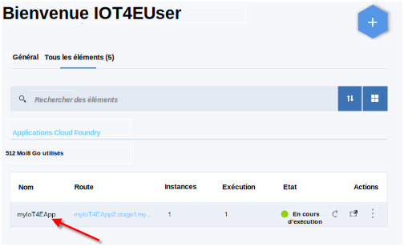
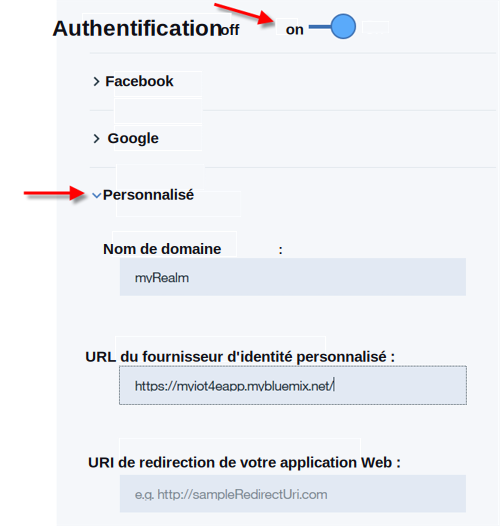

---

copyright:
  years: 2016, 2017
lastupdated: "2017-03-10"
---

<!-- Common attributes used in the template are defined as follows: -->
{:new_window: target="blank"}
{:shortdesc: .shortdesc}
{:screen: .screen}
{:codeblock: .codeblock}
{:pre: .pre}

# Configuration de la sécurité et de la connectivité mobile
{: #iot4e_configureMCA}

Activez la sécurité et les communications mobiles en configurant {{site.data.keyword.amafull}}. Vous devez effectuer cette tâche pour pouvoir utiliser le modèle d'application mobile, mais il suffit de l'effectuer une fois.
{:shortdesc}

Avant de commencer, déployez une instance du module de démarrage {{site.data.keyword.iotelectronics}} dans votre organisation {{site.data.keyword.Bluemix_notm}}. Cette opération entraîne le déploiement automatique des services et des applications de composant, y compris {{site.data.keyword.amafull}}.

1. Depuis le tableau de bord {{site.data.keyword.Bluemix_notm}}, ouvrez l'application {{site.data.keyword.iotelectronics}}.

   **Conseil :** L'application se trouve dans la section Applications de votre tableau de bord {{site.data.keyword.Bluemix_notm}}. Veillez à cliquer sur le nom et non sur le chemin.

    

2. Copiez l'adresse URL de l'application Web {{site.data.keyword.iotelectronics}} en cliquant avec le bouton droit de la souris sur **Afficher l'application** et en sélectionnant **Copier l'emplacement du lien**.

3. Dans l'onglet **Connexions**, cliquez sur le service {{site.data.keyword.amashort}} pour l'ouvrir.

3. Dans la page Authentification de {{site.data.keyword.amashort}}, activez l'authentification en cliquant sur **Activé**.

4. Dans la section **Personnalisé**, entrez les données d'authentification suivantes :

    - **Nom de domaine** : `myRealm`

    - **URL de fournisseur d'identité personnalisé** : collez l'adresse URL de l'application d'API que vous avez copiée au cours de la première étape au format suivant : **https://<*monAppDémarrageIoT4e*>.mybluemix.net**.

    **Important :** veillez à ce que l'adresse URL utilise le protocole sécurisé `https` même si la valeur que vous avez copiée utilise `http`.

    - **Vos URI de redirection d'application Web** : ne renseignez pas cette zone.

   

5. Sauvegardez vos paramètres. A présent, vous pouvez retourner dans la console du service {{site.data.keyword.iotelectronics}} ou dans votre console {{site.data.keyword.Bluemix_notm}}.
