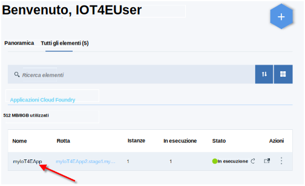
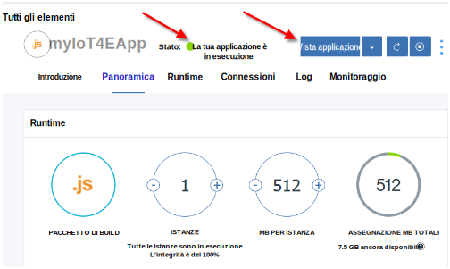
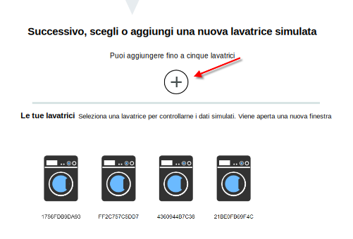

---

copyright:
  years: 2016, 2017
lastupdated: "2017-03-10"
---

<!-- Common attributes used in the template are defined as follows: -->
{:new_window: target="blank"}
{:shortdesc: .shortdesc}
{:screen: .screen}
{:codeblock: .codeblock}
{:pre: .pre}

# Utilizzo dell'applicazione starter
Crea delle applicazioni simulate nell'applicazione starter {{site.data.keyword.iotelectronics_full}}. Vedi in che modo un produttore aziendale può monitorare le applicazioni collegate a {{site.data.keyword.iot_short_notm}}. Interagisci manualmente con l'elettrodomestico simulato per attivare avvisi, notifiche e azioni.
{:shortdesc}

## Apertura dell'applicazione starter
{: #iot4e_openApp}

1. Nel tuo dashboard {{site.data.keyword.Bluemix_notm}}, avvia la tua applicazione starter {{site.data.keyword.iotelectronics}} facendo clic sul tile dell'applicazione starter.

    

2. Attendi il messaggio di stato *La tua applicazione è in esecuzione* nell'intestazione e quindi fai clic su **Visualizza applicazione** per visualizzare l'applicazione starter.

    

## Creazione di applicazioni simulate
{: #create_sim}

Nell'applicazione starter, puoi creare e controllare gli elettrodomestici simulati come produttore aziendale o come cliente. Lo stato e i dati evento di questi elettrodomestici simulati vengono archiviati e possono essere visualizzati in {{site.data.keyword.iot_full}}.

1. Selezionare una delle seguenti opzioni:
    - **Collega e gestisci gli elettrodomestici simulati** per creare elettrodomestici simulati come produttore aziendale
    - **Controlla in remoto i tuoi elettrodomestici simulati** per crearne di simulati e collegarli con l'[applicazione mobile di esempio](iotelectronics_config_mobile.html) come proprietario dell'elettrodomestico.

    

2. Passa alla sezione etichettata **Successivo, scegli o aggiungi una nuova lavatrice simulata** e fai clic sull'icona +. Viene creata una nuova lavatrice.

    

3. Per visualizzare i dettagli della tua lavatrice fai clic su una lavatrice. Nel pannello di controllo e comando, avvia la lavatrice o fai clic su tipi diversi di errori per visualizzare le modifiche dello stato. Puoi anche visualizzare le modifiche dello stato e controllare la lavatrice dalla tua applicazione mobile.

  

# Link correlati
{: #rellinks}

## Documentazione API
{: #api}
* [{{site.data.keyword.iotelectronics}} API](http://ibmiotforelectronics.mybluemix.net/public/iot4eregistrationapi.html)
* [{{site.data.keyword.iot_short}} API](https://developer.ibm.com/iotfoundation/recipes/api-documentation/)

## Componenti
{: #general}

* [{{site.data.keyword.iotelectronics}} documentation](iotelectronics_overview.html)
* [{{site.data.keyword.iot_full}} documentation](https://console.ng.bluemix.net/docs/services/IoT/index.html)
*  [{{site.data.keyword.amashort}} documentation](https://console.ng.bluemix.net/docs/services/mobileaccess/overview.html)
* [{{site.data.keyword.sdk4nodefull}} documentation](https://console.ng.bluemix.net/docs/runtimes/nodejs/index.html#nodejs_runtime)

## Esempi
{: #samples}
* [Applicazione mobile di esempio](https://console.ng.bluemix.net/docs/starters/IotElectronics/iotelectronics_config_mobile.html)
