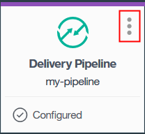

---

Copyright:
  Jahre: 2016

---

{:shortdesc: .shortdesc}
{:new_window: target="_blank"}

# Toolchains unter {{site.data.keyword.Bluemix_notm}} Dedicated verwenden
{: #toolchains-using_dedicated}

Letzte Aktualisierung: 13. September 2016
{: .last-updated}

Mithilfe einer Toolchain können Sie Ihre täglichen Entwicklungs-, Bereitstellungs- und Systemaufgaben produktiv abwickeln. Nach dem Einrichten einer Toolchain können Sie Toolintegrationen hinzufügen, löschen oder konfigurieren sowie den Zugriff auf die Toolchain verwalten.
{: shortdesc}

## Toolintegration konfigurieren
{: #configuring_a_tool_integration_dedicated}

Wenn Sie die Konfiguration einer Toolintegration beim Erstellen einer Toolchain noch nicht vorgenommen haben, wird eine Schaltfläche **Konfigurieren** auf der zugehörigen Kachel angezeigt. Wenn Sie beim Erstellen einer Toolchain eine Toolintegration konfiguriert haben, können Sie die Konfigurationseinstellungen aktualisieren.

1. Klicken Sie im Dashboard auf der Registerkarte **DEVOPS** auf die Toolchain, um die zugehörige Seite mit den Toolintegrationen anzuzeigen. Alternativ können Sie in der rechten oberen Ecke auf der Übersichtsseite der App auf **Toolchain anzeigen** klicken. Klicken Sie dann auf **Toolintegrationen**.
1. Wenn Sie eine Toolintegration erstmalig konfigurieren müssen, klicken Sie auf der zugehörigen Kachel auf **Konfigurieren**.

  

 Wenn Sie die Konfiguration der Toolintegration abgeschlossen haben, klicken Sie auf **Integration speichern**.
 
1. Wenn Sie die Konfiguration einer Toolintegration aktualisieren müssen, klicken Sie auf der zugehörigen Kachel auf das Menü für den Zugriff auf die Konfigurationsoptionen.

  
 
 Wenn Sie die Aktualisierung der Einstellungen abgeschlossen haben, klicken Sie auf **Integration speichern**.

## Toolintegration hinzufügen
{: #adding_a_tool_integration_dedicated}

Sie können Toolintegrationen für Ihre Toolchain hinzufügen und konfigurieren.

1. Klicken Sie im Dashboard auf der Registerkarte **DEVOPS** auf die Toolchain, um die zugehörige Seite mit den Toolintegrationen anzuzeigen. Alternativ können Sie in der rechten oberen Ecke auf der Übersichtsseite der App auf **Toolchain anzeigen** klicken. Klicken Sie dann auf **Toolintegrationen**.
1. Klicken Sie auf die Schaltfläche zum Hinzufügen (+), um eine Liste von hinzuzufügenden Toolintegrationen anzuzeigen.
1. Klicken Sie auf die Toolintegration, die Sie hinzufügen möchten.
1. Geben Sie alle erforderlichen Informationen zum Konfigurieren der Toolintegration ein. 
1. Klicken Sie auf **Integration erstellen**, um die Toolintegration zu Ihrer Toolchain hinzuzufügen.

## Toolintegration löschen
{: #deleting_a_tool_integration}

Wenn Sie eine Toolintegration aus Ihrer Toolchain löschen, kann diese Löschung nicht mehr rückgängig gemacht werden. 

1. Klicken Sie im Dashboard auf der Registerkarte **DEVOPS** auf die Toolchain, um die zugehörige Seite mit den Toolintegrationen anzuzeigen. Alternativ können Sie in der rechten oberen Ecke auf der Übersichtsseite der App auf **Toolchain anzeigen** klicken. Klicken Sie dann auf **Toolintegrationen**.
1. Klicken Sie auf der Kachel für die Toolintegration, die Sie löschen möchten, auf das Menü für den Zugriff auf die Konfigurationsoptionen.
1. Klicken Sie auf **Löschen**, um die Toolintegration aus Ihrer Toolchain zu löschen.
1. Bestätigen Sie dies, indem Sie nochmals auf **Löschen** klicken. 

## Zugriff verwalten
{: #managing_access_dedicated}

Sie können Benutzern Zugriff auf eine Toolchain gewähren, indem Sie sie zu der Organisation hinzufügen, der die Toolchain zugeordnet ist. Jede Toolchain ist einer bestimmten Organisation zugeordnet und alle Benutzer, die Mitglied dieser Organisation sind, können auf die zugeordneten Toolchains zugreifen. Um die Organisation anzuzeigen, in der Sie gerade arbeiten, klicken Sie auf das Symbol **{{site.data.keyword.avatar}}**  in der Menüleiste. Um auf andere Toolchains zugreifen zu können, wechseln Sie zu einer anderen Organisation.

Wenn Sie Benutzer zu Ihren {{site.data.keyword.Bluemix}}-Organisationen und -Bereichen hinzufügen, können sich die Benutzer mit ihrer {{site.data.keyword.Bluemix_notm}}-ID und dem zugehörigen Kennwort bei GitHub Enterprise anmelden. Wenn sich die Benutzer anmelden, werden Konten für sie erstellt. Wenn Sie Benutzer zu Ihren {{site.data.keyword.Bluemix_notm}}-Organisationen und -Bereichen hinzufügen, werden sie nicht automatisch dem GitHub Enterprise-Repository hinzugefügt. Ein Benutzer mit Verwaltungsrechten für das Repository muss sie hinzufügen. Weitere Informationen finden Sie im Abschnitt zur Verwendung von [Dedicated GitHub Enterprise (Link wird in neuem Fenster geöffnet)](../services/ghededicated/index.html){: new_window}.

Führen Sie die folgenden Schritte aus, um einen Benutzer hinzuzufügen: 

1. Klicken Sie im Dashboard auf der Registerkarte **DEVOPS** auf die Toolchain, um die zugehörige Seite mit den Toolintegrationen anzuzeigen. Klicken Sie anschließend auf **Verwalten**. Alternativ können Sie in der rechten oberen Ecke auf der Übersichtsseite der App auf **Toolchain anzeigen** klicken. Klicken Sie anschließend auf **Verwalten**.  
1. Klicken Sie auf den Link zu Ihrer Organisation. 
1. Klicken Sie auf der Seite 'Organisationen verwalten' auf **Benutzer einladen** und geben Sie die E-Mail-Adresse des Benutzers ein.
1. Wenn Sie erweiterte Berechtigungen zur Verwaltung von Benutzern in {{site.data.keyword.Bluemix_notm}}-Organisationen erteilen möchten, wählen Sie mindestens eines der folgenden Kontrollkästchen aus: **Manager**, **Abrechnungsmanager** und **Auditor**.
1. Klicken Sie auf **EINLADEN**.
1. Klicken Sie auf **SPEICHERN**.

## Toolchain löschen
{: #deleting_a_toolchain_dedicated}

Sie können eine Toolchain löschen und angeben, welche der zugehörigen Toolintegrationen ebenfalls gelöscht werden sollen. Wenn Sie eine Toolchain löschen, kann diese Löschung nicht mehr rückgängig gemacht werden.

1. Klicken Sie im Dashboard auf der Registerkarte **DEVOPS** auf die Toolchain, um die zugehörige Seite mit den Toolintegrationen anzuzeigen. Klicken Sie anschließend auf **Verwalten**. Alternativ können Sie in der rechten oberen Ecke auf der Übersichtsseite der App auf **Toolchain anzeigen** klicken. Klicken Sie anschließend auf **Verwalten**.
1. Klicken Sie auf **Toolchain löschen** und überprüfen oder ändern Sie die zu löschenden Toolintegrationen.
1. Bestätigen Sie das Löschen, indem Sie den Namen der Toolchain eingeben und auf **Löschen** klicken.

 **Tipp**: Wenn Sie eine GitHub Enterprise-Toolintegration löschen, wird das zugeordnete GitHub Enterprise-Repository nicht aus der Toolintegration gelöscht. Sie müssen das Repository manuell aus GitHub Enterprise entfernen.
