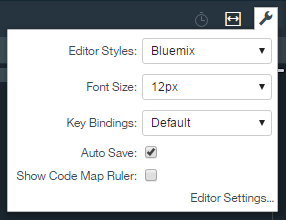

---

copyright:
  years: 2015, 2016

---

{:new_window: target="_blank"}
{:shortdesc: .shortdesc}
{:screen:.screen}
{:codeblock:.codeblock}
{:pre: .pre}

# Eclipse Orion {{site.data.keyword.webide}}로 코드 편집
{: #web_ide}

마지막 업데이트 날짜: 2016년 9월 9일
{: .last-updated}

Eclipse Orion {{site.data.keyword.webide}}는 웹용으로 개발할 수 있는 브라우저 기반 개발 환경입니다. 컨텐츠 지원, 코드 자동 완성 및 오류 검사를 사용하여 JavaScript, HTML 및 CSS로 개발할 수 있습니다. {{site.data.keyword.webide}}는 거의 모든 언어와 작동하며 대부분의 [파일 유형(링크가 새 창에서 열림)](https://hub.jazz.net/docs/overview/#dev_support){: new_window}에 대한 구문 강조표시를 제공합니다. 소스 제어는 Git 또는 Jazz SCM을 통해 내장되며 앱을 테스트하고 디버그하기 위해 로컬에 코드를 배치할 수 있습니다.
{:shortdesc}

무엇보다도 {{site.data.keyword.webide}}는 웹을 통해 구동됩니다. 설치하거나 유지보수하거나 스케일링할 필요가 없습니다. 인터넷에 연결되어 있으면 어디서든 개발할 수 있습니다.

## 편집기 설정
{: #editorsetup}

{{site.data.keyword.webide}}는 사용자가 색상 구성표, 기술 도구 및 개발 요구사항에 맞는 설정을 선택할 수 있도록 사용자 정의할 수 있습니다. 설정을 보고 수정하려면 왼쪽에 있는 메뉴에서 **설정** 아이콘 을 클릭하십시오.

편집하는 동안 자주 특정 설정을 변경해야 하는 경우 편집기의 오른쪽 상단에 있는 **로컬 편집기 설정** 아이콘 을 통해 해당 설정에 신속하게 액세스할 수 있습니다.



기본적으로 편집기 스타일 및 글꼴 크기 설정은 항상 표시됩니다. 메뉴에 다른 편집기 설정을 포함하려면 다음 단계를 따르십시오.

1. **로컬 편집기 설정** 아이콘 을 클릭하십시오.

2. **편집기 설정**을 클릭하십시오.

3. **로컬 편집기 설정** 메뉴에서 설정을 포함하거나 제외하려면 설정 옆에 있는 원을 클릭하십시오.


## 코드 편집
{: #editcode}

{{site.data.keyword.webide}}에는 두 개의 기본 섹션이 있습니다. 첫 번째 섹션은 왼쪽에 있는 파일 네비게이터이며, 여기에는 트리 구조로 프로젝트 파일이 표시됩니다. 파일 네비게이터에서 파일과 폴더를 작성, 이름 바꾸기, 삭제 및 관리할 수 있습니다.

**팁:** 파일 네비게이터에 파일을 업로드하려면 컴퓨터에서 파일 네비게이터로 끌어 오십시오.

두 번째 섹션은 오른쪽에 있는 편집기 분할창입니다. 이 편집기에서는 컨텐츠 지원 및 구문 유효성 검증을 포함하는 여러 코딩 기능을 제공합니다.


### 여러 파일에 대한 작업
1. 동시에 두 개의 파일에 대해 작업하려면 편집기의 맨 위에 있는 **분할 편집기 모드 변경** 아이콘 을 클릭하십시오.
2. 메뉴가 열리면 보기를 선택하십시오.

 보기를 선택한 다음 파일이 편집기에 이미 열려 있으면 두 편집기 보기 모두에 파일이 표시됩니다.

 편집기 보기 중 하나에 표시되는 파일을 열거나 변경하려면 다음을 수행하십시오.
 1. 변경할 편집기 보기로 커서를 이동하십시오.
 2. 파일 네비게이터에서 파일을 클릭하십시오.

### 키보드 단축키
{{site.data.keyword.webide}}에 있는 대부분의 명령은 키보드 단축키를 통해서만 액세스할 수 있습니다.

편집기에서 키보드 단축키 목록을 보려면 Alt+Shift+?를 누르십시오. Mac OS를 사용하는 경우 Ctrl+Shift+?를 누르십시오.

## 소스 코드 관리
{: #sourcecontrol}

{{site.data.keyword.webide}}는 소스 코드 관리 도구와 통합됩니다. Git 저장소에 대해 작업하려면 **Git 저장소** 아이콘 을 클릭하십시오. 자세한 정보는 [Git로 소스 제어(링크가 새 창에서 열림)](https://hub.jazz.net/docs/git/){: new_window}를 참조하십시오.


## 작업공간에서 앱 배치
{: #deploy}

1. 앱을 배치하려면 실행 표시줄에서 실행 구성을 선택하거나 [작성(링크가 새 창에서 열림)](https://hub.jazz.net/tutorials/livesync/#launch_configuration){: new_window}하십시오.
1. 배치 아이콘 을 클릭하십시오. 앱의 인스턴스는 작업공간의 현재 컨텐츠와 실행 구성에 정의된 환경을 사용하여 배치합니다. 
2. 앱을 배치하고 나면 실행 표시줄을 사용하여 앱을 중지, 다시 시작 또는 디버그하고 로그를 보는 등의 작업을 수행할 수 있습니다.


<!-- LH: I'm commenting out the following list because I think this information is obvious from the UI. I also updated the preceding sentence to mention a few things that you can do from the run bar.

 * Stop the app: 
 * Open the deployed app: 
 * View the logs of the deployed app: 
 * Open the app's Dashboard: 
 * If you are developing a Node.js app, enable Live Edit mode: 
 * With Live Edit mode enabled, restart the app quickly, without redeployment: 
 * With Live Edit mode enabled, access the debugger:  -->

 ## {{site.data.keyword.webide}} 외부에서 편집
{: #editlocal}

{{site.data.keyword.webide}} 이외의 편집기를 사용하려면 어느 도구에서나 프로젝트 파일에 대해 직접 작업할 수 있도록 {{site.data.keyword.Bluemix_live}}를 설정하십시오. {{site.data.keyword.Bluemix_live_notm}}는 로컬 파일 시스템의 변경사항을 {{site.data.keyword.jazzhub}}의 클라우드 작업공간과 동기화하는 명령행 애플리케이션입니다. 

### 시작하기 전에 

[{{site.data.keyword.Bluemix_live_notm}} 명령행 인터페이스(링크가 새 창에서 열림)](http://livesyncdownload.ng.bluemix.net){: new_window}를 다운로드하여 설치하십시오.

### 로컬 환경을 {{site.data.keyword.Bluemix_notm}}와 동기화
{: #edit_local_download}

1. 명령행 창을 여십시오.
2. 다음을 수행하여 {{site.data.keyword.Bluemix_notm}}에 로그인하십시오.

	```
	bl login
	```
	{: pre}

3. 프롬프트가 표시되면 IBM ID 및 비밀번호를 입력하십시오.
4. 다음을 수행하여 {{site.data.keyword.Bluemix_notm}} 프로젝트 목록을 보십시오. 

	```
	bl projects
	```
	{: pre}

4. 다음을 수행하여 로컬 환경을 {{site.data.keyword.Bluemix_notm}}의 프로젝트와 동기화하십시오.

	```
	bl sync projectName
	```
	{: pre}

여기서 `projectName`은 {{site.data.keyword.Bluemix_notm}} 앱의 이름입니다.

편집을 완료하면 `q`를 입력하여 동기화를 종료하십시오.

### Desktop Sync 기능을 사용하여 로컬에서 코드 편집

Desktop Sync 기능은 명령행의 Live Edit 모드와 유사합니다. 명령행에서 디버그하려면 Desktop Sync 기능이 필요합니다.
1. 다른 명령행 창에서 다음과 같이 Desktop Sync 기능을 사용하십시오.

	```
	cd localDirectory
	bl start
	```
	{: codeblock}

2. {{site.data.keyword.webide}}에서 작성한 실행 구성을 사용하십시오. 실행 구성을 선택하고 나면 로컬 환경에서 Desktop Sync 기능이 사용됩니다. 방금 연 명령행 창에서 앱의 URL, 디버그 URL, 관리 URL을 보고 {{site.data.keyword.Bluemix_live_notm}} 상태를 볼 수 있습니다.

3. 브라우저를 새로 고치고 로컬 작업공간에서 정적 파일에 저장한 변경사항이 표시되는지 확인하십시오. 

### Desktop Sync 기능 사용 안함

1. 두 번째 명령행 창에서 `bl stop`을 입력하십시오.
2. 첫 번째 명령행 창에서 `q`를 입력하십시오.
