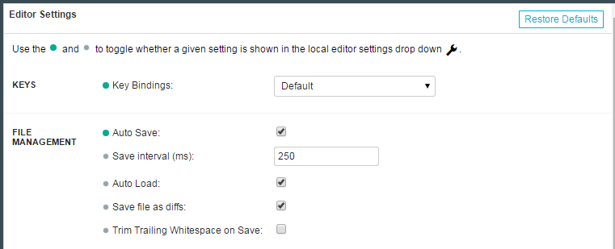

---

copyright:
  years: 2015, 2016

---

{:new_window: target="_blank"}
{:shortdesc: .shortdesc}
{:screen:.screen}
{:codeblock:.codeblock}
{:pre: .pre}

# 使用 Eclipse Orion {{site.data.keyword.webide}} 編輯程式碼
{: #web_ide}

前次更新：2016 年 9 月 9 日
{: .last-updated}

Eclipse Orion {{site.data.keyword.webide}} 是一種您可以針對 Web 進行開發的瀏覽器型開發環境。有了內容輔助、程式碼完成及錯誤檢查的協助，您就可以使用 JavaScript、HTML 及 CSS 進行開發。{{site.data.keyword.webide}} 幾乎使用任何語言，並且提供大部分[檔案類型（在新視窗中開啟鏈結）](https://hub.jazz.net/docs/overview/#dev_support){: new_window}的語法強調顯示。來源控制是透過 Git 或 Jazz SCM 所建置，而且您可以在本端部署程式碼來測試及除錯應用程式。
{:shortdesc}

最好的是，{{site.data.keyword.webide}} 採用 Web 技術。您沒有要安裝的項目、要維護的項目，以及要調整的項目。您可以在具有網際網路連線的任何位置進行開發。

## 設定編輯器
{: #editorsetup}

{{site.data.keyword.webide}} 可進行自訂，以選擇色系、技術工具，以及符合開發需求的設定。若要檢視及修改設定，請從左邊的功能表中，按一下**設定**圖示 。

如果您經常需要在編輯時變更特定設定，則可以從編輯器右上角的**本端編輯器設定**圖示  快速存取這些設定。


預設一律會顯示編輯器樣式及字型大小的設定。若要在功能表中包括其他編輯器設定，請遵循下列步驟：

1. 按一下**本端編輯器設定**圖示 。

2. 按一下**編輯器設定**。

3. 若要從**本端編輯器設定**功能表中包括或排除設定，請按一下設定旁邊的圓形。




## 編輯程式碼
{: #editcode}

{{site.data.keyword.webide}} 有兩個主要區段。第一個區段是左邊的檔案導覽器，會以樹狀結構顯示專案檔。您可以從檔案導覽器中建立、重新命名、刪除及管理檔案和資料夾。

**提示：**若要將檔案上傳至檔案導覽器，請將它們從您的電腦拖曳至檔案導覽器。

第二個區段是右邊的編輯器窗格。編輯器提供數個程式碼特性（包括內容輔助及語法驗證）。


### 使用多個檔案
1. 若要同時使用兩個檔案，請按一下編輯器頂端的**變更分割編輯器模式**圖示 。
2. 從開啟的功能表中，選取視圖。

 在您選取視圖之後，如果已在編輯器中開啟檔案，則會以兩種編輯器視圖顯示檔案。

 若要開啟或變更在其中一個編輯器視圖中顯示的檔案，請執行下列動作：
 1. 將游標移至您要變更的編輯器視圖。
 2. 在檔案導覽器中，按一下檔案。

### 鍵盤快速鍵
只能透過鍵盤快速鍵存取 {{site.data.keyword.webide}} 中的大部分指令。

若要查看編輯器中的鍵盤快速鍵清單，請按 Alt+Shift+?。如果您是使用 Mac OS，請按 Ctrl+Shift+?。

## 管理原始碼
{: #sourcecontrol}

{{site.data.keyword.webide}} 是與原始碼管理工具整合。若要使用 Git 儲存庫，請按一下 **Git 儲存庫**圖示 。如需相關資訊，請參閱[使用 Git 進行來源控制（在新視窗中開啟鏈結）](https://hub.jazz.net/docs/git/){: new_window}。


## 從工作區部署應用程式
{: #deploy}

1. 若要部署應用程式，請從執行列中選取或[建立（在新視窗中開啟鏈結）](https://hub.jazz.net/tutorials/livesync/#launch_configuration){: new_window}啟動配置。
1. 按一下部署圖示 。使用您工作區的現行內容以及啟動配置中所定義的環境，即可部署您應用程式的實例。 
2. 部署應用程式之後，即可使用執行列來停止、重新啟動或除錯應用程式、檢視日誌，以及執行其他作業。


<!-- LH: I'm commenting out the following list because I think this information is obvious from the UI. I also updated the preceding sentence to mention a few things that you can do from the run bar.

 * Stop the app: 
 * Open the deployed app: 
 * View the logs of the deployed app: 
 * Open the app's Dashboard: 
 * If you are developing a Node.js app, enable Live Edit mode: 
 * With Live Edit mode enabled, restart the app quickly, without redeployment: 
 * With Live Edit mode enabled, access the debugger:  -->

 ## 在 {{site.data.keyword.webide}} 外部編輯
{: #editlocal}

若要使用 {{site.data.keyword.webide}} 以外的編輯器，請設定 {{site.data.keyword.Bluemix_live}}，以便直接在任何工具中使用專案檔。{{site.data.keyword.Bluemix_live_notm}} 是一種指令行應用程式，可同步化本端檔案系統中的變更與 {{site.data.keyword.jazzhub}} 中的雲端工作區。 

### 開始之前 

下載並安裝 [{{site.data.keyword.Bluemix_live_notm}} 指令行介面（在新視窗中開啟鏈結）](http://livesyncdownload.ng.bluemix.net){: new_window}。

### 同步化本端環境與 {{site.data.keyword.Bluemix_notm}}
{: #edit_local_download}

1. 開啟指令行視窗。
2. 登入 {{site.data.keyword.Bluemix_notm}}：

	```
	bl login
	```
	{: pre}

3. 系統提示您時，請輸入 IBM ID 及密碼。
4. 檢視 {{site.data.keyword.Bluemix_notm}} 專案清單： 

	```
	bl projects
	```
	{: pre}

4. 同步化本端環境與 {{site.data.keyword.Bluemix_notm}} 上的專案：

	```
	bl sync projectName
	```
	{: pre}

其中 `projectName` 是您 {{site.data.keyword.Bluemix_notm}} 應用程式的名稱。

完成編輯時，請輸入 `q` 以結束同步化。

### 啟用桌面同步特性以在本端編輯程式碼

「桌面同步」特性就像指令行的「即時編輯」模式。您需要「桌面同步」特性，才能在指令行上進行除錯。
1. 在另一個指令行視窗中，啟用「桌面同步」特性：

	```
	cd localDirectory
	bl start
	```
	{: codeblock}

2. 使用您在 {{site.data.keyword.webide}} 中建立的啟動配置。在您選取啟動配置之後，會在本端環境中啟用「桌面同步」特性。在剛剛開啟的指令行視窗中，您可以檢視應用程式的 URL、除錯 URL、管理 URL，以及檢視 {{site.data.keyword.Bluemix_live_notm}} 狀態。

3. 重新整理瀏覽器，並驗證您可以在本端工作區中看到儲存至靜態檔案的變更。 

### 停用桌面同步特性

1. 在第二個指令行視窗中，輸入 `bl stop`。
2. 在第一個指令行視窗中，輸入 `q`。
